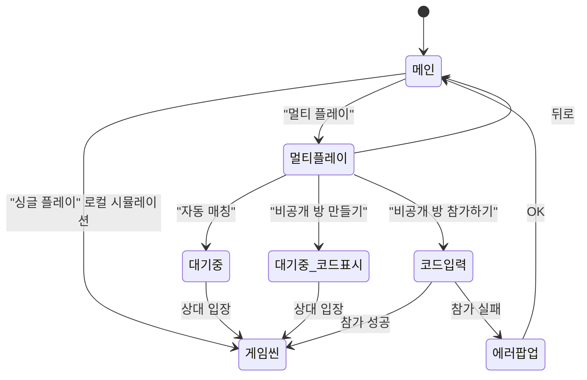
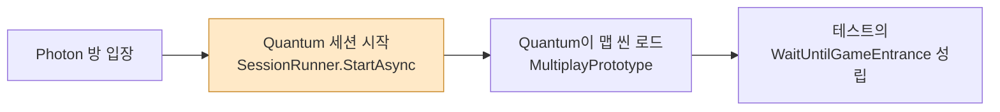
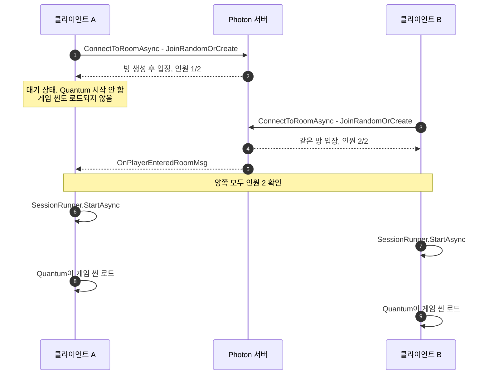
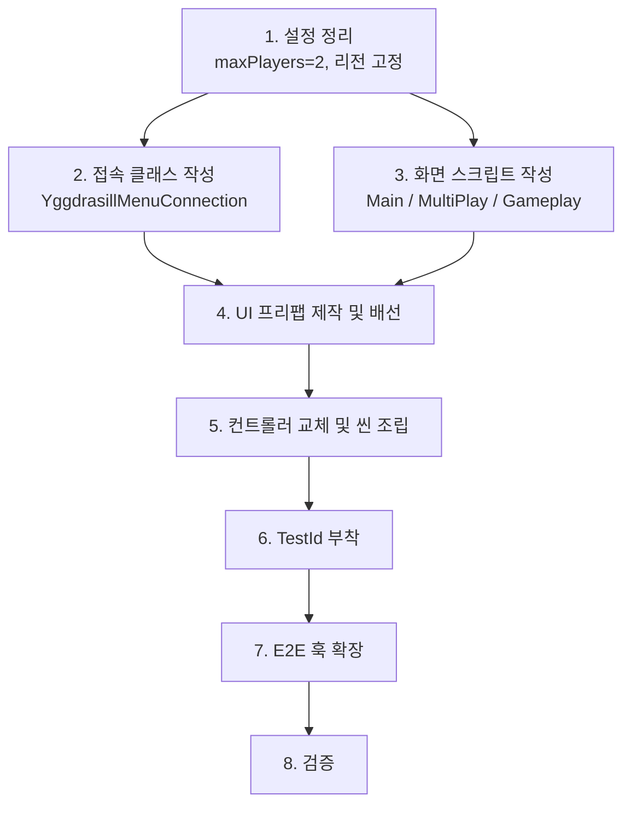

# 메뉴 개편 튜토리얼 — 싱글 플레이 / 멀티 플레이 메뉴 만들기

`Docs/requirements.adoc`의 "메뉴 씬" 요구사항을 충족하도록 현재 Photon Quantum 샘플 메뉴를 개편하는 **작업 지침서**입니다. 무엇을, 어떤 순서로, 왜 그렇게 해야 하는지를 설명합니다.

먼저 읽으면 좋은 배경 문서:

- [GUI 구조와 이벤트 배선](quantum-menu-gui-guide.md) — 화면·버튼·`SendMessage` 배선 구조
- [매치메이킹부터 시뮬레이션 시작까지](quantum-menu-connection-guide.md) — `ConnectAsync` 내부 5단계

---

## 0. 목표와 완료 조건

### 만들려는 것



### 완료 조건 — E2E 테스트가 곧 명세다

이 작업의 합격 기준은 이미 코드로 적혀 있습니다.

| 테스트 | 파일 | 검증 내용 |
|---|---|---|
| `SinglePlayEntranceTest.SinglePlayEntrance` | `StandAloneTest/Yggdrasill.Tests.E2E/SinglePlayEntranceTest.cs` | 싱글 플레이 버튼 클릭 → 게임 씬 진입 → 타일 클릭 → 묘목 생성 |
| `MatchingTest.AutoMatchingTest(3)` / `(4)` | `.../MatchingTest.cs` | N개 클라이언트가 **2개씩 짝지어** 매칭. 홀수면 정확히 하나가 매칭되지 않고 **게임 씬에 진입하지 않아야** 함 |
| `MatchingTest.PrivateRoomMathcingTest` | `.../MatchingTest.cs` | 방 생성 → 참가 코드 획득 → 다른 클라이언트가 코드로 참가 → 양쪽 동기화 |

**이 테스트들을 통과시키는 것이 목표입니다.** 아래 모든 설계 결정은 여기서 역산한 것입니다.

---

## 1. 현재 상태 진단

작업을 시작하기 전에 지금 무엇이 있고 무엇이 없는지 확인하세요.

### 이미 되어 있는 것

| 항목 | 위치 | 비고 |
|---|---|---|
| 메뉴 씬 | `Assets/Scenes/MenuPrototype.unity` | Camera + Canvas + EventSystem + `QuantumMenu Variant` |
| 메뉴 프리팹 변형 | `Assets/Prefabs/QuantumMenu Variant.prefab` | 스톡 `QuantumMenu.prefab`의 Variant. `_config`만 오버라이드 |
| 메뉴 설정 | `Assets/QuantumUser/Resources/YggdrasillMenuConfig.asset` | 최대 6인, 리전 4개, AppVersion `1.0` |
| 맵/씬 정보 | `.../Resources/Maps/MultiplayPrototype_QuantumMenuSceneInfo.asset` | `MultiplayPrototype` 씬 |
| 테스트 훅 인프라 | `Assets/Scripts/TestHelper/**` | `TestId`, `UGuiClickPointProvider`, `TestHookApi`, `VirtualDevice` |
| 식별자 enum | `.../Protocol/GameObjectId.cs` | 필요한 값이 **이미 전부 정의되어 있음** |
| 버튼 태깅 1건 | `MenuPrototype.unity` | QuickPlay 버튼에 `TestId(id=SinglePlayButton)` + `UGuiClickPointProvider`가 이미 부착됨 |

### 아직 없는 것

| 빠진 것 | 영향 |
|---|---|
| 싱글 플레이 경로 | 현재 QuickPlay는 **온라인 랜덤 매칭**임. 로컬 시뮬레이션 진입 수단이 없음 |
| 멀티플레이 화면 | 자동 매칭 / 방 만들기 / 방 참가하기 3버튼 화면 없음 |
| "상대를 기다리는" 동작 | 현재는 방에 혼자 있어도 즉시 게임 씬 진입 (3장 참고) |
| 참가 코드 표시 UI | 방 생성 후 코드를 보여줄 곳이 없음 |
| `ITestHookApi.GetInvitationCode` | `MatchingTest`가 호출하지만 **선언 자체가 없음** |
| `ITestHookApi.SubmitPrivateRoomInvitationCode` | 위와 동일 |
| `ApplicationRunner`의 래퍼 메서드 2개 | 위 두 API를 호출할 클라이언트 측 메서드 |

> **중요**: 마지막 세 항목 때문에 `Yggdrasill.Tests.E2E` 프로젝트는 **현재 컴파일되지 않습니다.** `MatchingTest.PrivateRoomMathcingTest`가 존재하지 않는 메서드를 호출합니다. 작업을 시작하기 전에 이 사실을 인지하세요 — 7단계에서 해결합니다.

> `MatchingTest._photonAppVersion` 필드는 선언되어 있으나 **아무 곳에서도 사용되지 않습니다.** 테스트마다 AppVersion을 격리하려던 의도로 보이며, 3-3장에서 다룹니다.

---

## 2. 목표 화면 구성

만들 화면은 다음과 같습니다. 스톡 화면 중 **재사용할 것과 버릴 것**을 명확히 구분하세요.

| 화면 | 스톡 대응 | 처리 |
|---|---|---|
| 메인 (싱글/멀티 2버튼) | `QuantumMenuUIMain` | **새로 작성** (아래 설명) |
| 멀티플레이 (3버튼) | `QuantumMenuUIParty` | 새로 작성하되 파티 화면 로직을 참고 |
| 참가 코드 입력 | `QuantumMenuUIParty`의 입력 필드 | 멀티플레이 화면에 통합 가능 |
| 대기 / 로딩 | `QuantumMenuUILoading` | **재사용** (참가 코드 라벨만 추가) |
| 인게임 | `QuantumMenuUIGameplay` | **버림** — 새로 작성 (3-2장 참고) |
| 에러 팝업 | `QuantumMenuUIPopup` | **그대로 재사용** |
| 맵 선택 / 설정 | `QuantumMenuUIScenes` / `QuantumMenuUISettings` | **제거** |

### 메인 화면을 새로 작성하는 이유

`QuantumMenuUIMain`을 상속해서 버튼만 줄이면 될 것 같지만, 실제로는 그렇지 않습니다. 이 클래스의 `Awake()`와 `Show()`는 다음 직렬화 필드를 **null 검사 없이** 사용합니다.

```
_quitButton, _usernameView, _usernameLabel, _usernameInput,
_playButton, _partyButton, _sceneButton, _sceneThumbnail
```

버튼 2개짜리 화면을 만들려면 쓰지도 않을 UI 오브젝트를 전부 만들어 물려줘야 합니다. **`QuantumMenuUIScreen`을 직접 상속해 새로 쓰는 편이 훨씬 간단합니다.**

단, `QuantumMenuUIMain`이 하던 일 중 **반드시 옮겨와야 하는 것**이 있습니다.

```csharp
// QuantumMenuUIMain.Init() 에서
ConnectionArgs.LoadFromPlayerPrefs();
ConnectionArgs.SetDefaults(Config);   // ← 이게 없으면 ConnectArgs.Scene 이 null

// QuantumMenuUIMain.Awake() 에서
Application.runInBackground = true;   // ← E2E에서 여러 클라이언트를 동시에 돌리려면 필수
```

특히 `runInBackground`는 **E2E 테스트의 생명줄**입니다. 포커스를 잃은 게임 창이 멈추면 매칭 테스트가 통째로 실패합니다.

---

## 3. 먼저 이해해야 할 설계 문제 셋

코드를 쓰기 전에 이 세 가지를 이해해야 합니다. 순서를 건너뛰면 나중에 크게 되돌리게 됩니다.

### 3-1. "두 번째 플레이어를 기다린다"가 스톡 흐름에는 없다

요구사항:

> 자동 매칭 버튼 클릭 시, 클라이언트 풀 내에 **매칭 대기 중인 다른 클라이언트가 존재할 때까지 대기**한다.

그런데 `SessionRunner.StartAsync()`는 **다른 플레이어를 기다리지 않습니다.** Quantum 시작 프로토콜은 서버와 이 클라이언트 사이의 합의일 뿐이고, 방에 혼자 있어도 즉시 완료됩니다. 스톡 QuickPlay를 그대로 쓰면 홀수 번째 클라이언트도 게임 씬에 들어가 버려 `AutoMatchingTest(3)`이 실패합니다.

**다행인 사실이 하나 있습니다.** 이 프로젝트의 `QuantumDefaultConfigs.asset`은 `AutoLoadSceneFromMap: 2` (= `UnloadPreviousSceneThenLoad`)입니다. 즉 게임 씬은 메뉴가 미리 로드하지 않고, **Quantum이 시뮬레이션 시작 후에** 로드합니다.



게임 씬 진입이 `StartAsync` **이후**에 일어나므로, **방 입장과 Quantum 시작 사이에 대기 단계를 끼워 넣으면** 요구사항과 테스트가 동시에 충족됩니다.



**핵심 결론**: 커스텀 접속 클래스에서 "방 입장 → **인원이 2가 될 때까지 대기** → Quantum 시작" 순서를 직접 구현해야 합니다.

### 3-2. SDK 접속 클래스는 상속만으로 못 바꾼다

`QuantumMenuConnectionBehaviourSDK`를 상속해 `ConnectAsyncInternal`만 오버라이드하는 방법이 먼저 떠오르지만, **작동하지 않습니다.**

```csharp
public class QuantumMenuConnectionBehaviourSDK : QuantumMenuConnectionBehaviour {
  private RealtimeClient _client;                       // ← private
  public QuantumRunner Runner { get; private set; }     // ← private set
  public override RealtimeClient Client => _client;
  public override string SessionName => Client?.CurrentRoom?.Name;
  public override List<string> Usernames { get => ... Runner.Game ... }
}
```

`base.ConnectAsyncInternal`을 건너뛰면 `_client`와 `Runner`가 영원히 null로 남고, `Client` / `SessionName` / `Usernames` / `IsConnected` / `Ping` 이 전부 잘못된 값을 반환합니다. 파생 클래스에서 이 필드들을 채울 방법이 없습니다.

따라서 두 가지 선택지가 있습니다.

| | 방법 A — `QuantumMenuConnectionBehaviour` 직접 구현 (권장) | 방법 B — SDK 파일 복사 후 수정 |
|---|---|---|
| 방식 | 추상 클래스를 상속해 필요한 것만 새로 구현 | `QuantumMenuConnectionBehaviourSDK.cs`를 프로젝트로 복사해 편집 |
| 코드량 | 약 150~200줄 | 약 500줄 (대부분 안 쓰는 코드) |
| SDK 업데이트 | 추상 메서드 시그니처만 확인하면 됨 | 수동 병합 필요 |
| 재접속/MPPM/리전요약 | 필요 없으므로 구현 안 함 | 딸려 옴 |

**방법 A를 권장합니다.** 재접속, MPPM 브로드캐스트, 베스트 리전 캐시 등 이 프로젝트에 필요 없는 기능이 SDK 코드의 대부분입니다.

구현해야 할 추상 멤버는 다음과 같습니다.

```csharp
public abstract string SessionName { get; }
public abstract int    MaxPlayerCount { get; }
public abstract string Region { get; }
public abstract string AppVersion { get; }
public abstract List<string> Usernames { get; }
public abstract bool   IsConnected { get; }
public abstract int    Ping { get; }
public abstract Task<List<QuantumMenuOnlineRegion>> RequestAvailableOnlineRegionsAsync(QuantumMenuConnectArgs a);
protected abstract Task<ConnectResult> ConnectAsyncInternal(QuantumMenuConnectArgs a);
protected abstract Task DisconnectAsyncInternal(int reason);
// + public virtual RealtimeClient Client { get; }  ← override 필요
```

`RequestAvailableOnlineRegionsAsync`는 리전 목록 UI를 쓰지 않는다면 `Task.FromResult(new List<...>())`로 두어도 됩니다.

### 3-3. 클라이언트 풀 = Photon AppVersion

요구사항의 정의:

> **클라이언트 풀**: 게임 버전 설정이 일치하는 모든 클라이언트 집합.

Photon에서 이 역할을 하는 것이 **AppVersion**입니다. 같은 AppId라도 AppVersion이 다르면 매치메이킹이 완전히 분리됩니다. 따라서 `AppVersion = Application.version`으로 묶으면 요구사항이 그대로 충족됩니다.

구현 방법은 별도로 정리되어 있습니다 — 요약하면 **접속 직전에 `QuantumMenuConnectArgs.AppVersion`을 덮어써야** 합니다. `PhotonServerSettings.AppSettings.AppVersion`을 고쳐도 `ConnectArgs.AppVersion`이 그것을 덮어쓰기 때문에 소용없습니다.

방법 A로 접속 클래스를 직접 쓴다면, `MatchmakingArguments`를 만드는 자리에서 한 줄이면 됩니다.

```csharp
PhotonSettings = new AppSettings(connectArgs.AppSettings) {
  AppVersion  = ResolveAppVersion(),   // ← 아래 참고
  FixedRegion = connectArgs.Region,
},
```

#### E2E 테스트 격리를 위한 오버라이드가 필요하다

여기가 중요합니다. `AutoMatchingTest`는 클라이언트 3~4개를 띄워 **서로** 매칭시킵니다. 만약 AppVersion이 그냥 `Application.version`이면, 같은 시각 CI에서 도는 다른 테스트 실행분이나 개발자 PC의 클라이언트와 섞여 매칭될 수 있습니다. 그러면 "홀수면 하나가 남는다"는 검증이 무작위로 깨집니다.

`MatchingTest`가 `_photonAppVersion = Guid.NewGuid().ToString()`을 들고 있는 이유가 이것입니다. **테스트 실행마다 고유한 AppVersion을 게임 프로세스에 주입해야 합니다.**

권장 설계:

```csharp
// 게임 측
private static string ResolveAppVersion() {
  // --photon-app-version <값> 이 있으면 그것을, 없으면 Application.version 을 사용
  var args = System.Environment.GetCommandLineArgs();
  for (int i = 0; i < args.Length - 1; i++)
    if (args[i] == "--photon-app-version") return args[i + 1];
  return Application.version;
}
```

테스트 측에서는 `ApplicationRunner`가 이 인자를 붙여 프로세스를 띄우도록 확장합니다. `ITestHookApi.PortCommandLineArgumentName`과 같은 패턴으로 인자 이름 상수를 프로토콜에 두면 양쪽이 어긋나지 않습니다.

#### 리전도 함께 고정할 것

Photon 방은 **리전마다 완전히 분리**됩니다. 두 클라이언트가 서로 다른 리전을 고르면 같은 코드로도 만나지 못합니다. 스톡 파티 화면은 이 문제를 "코드 4번째 글자에 리전을 인코딩"해서 풀지만, 요구사항에는 리전 개념이 없습니다.

**가장 단순한 해법은 리전을 하나로 고정하는 것입니다.** `YggdrasillMenuConfig`의 `_availableRegions`를 단일 값(예: `asia`)으로 두고 `ConnectArgs.PreferredRegion`을 거기에 맞추면, 참가 코드에 리전을 인코딩할 필요가 없어져 코드 생성/검증이 단순해집니다.

---

## 4. 작업 순서



2단계와 3단계는 병렬로 진행할 수 있습니다. 4단계부터는 순서대로 하세요.

---

## 5. 단계별 작업

### Step 1. 설정 정리

**1-1. 최대 인원을 2로 고정**

`Assets/QuantumUser/Resources/YggdrasillMenuConfig.asset`에서 `_maxPlayers`를 **2**로 변경합니다.

이것이 중요한 이유는 요구사항의 비공개 방 참가 조건 때문입니다.

> 2. 해당 방에 클라이언트가 하나 뿐이다.

방 정원이 2면 Photon이 세 번째 참가자를 `ErrorCode.GameFull`로 거절합니다. **조건을 직접 검사할 코드를 쓸 필요가 없습니다.**

`AutoMatchingTest`가 "2개씩 짝을 이룬다"를 검증하는 것도 같은 이유로 자동 충족됩니다.

**1-2. 리전 고정**

같은 파일의 `_availableRegions`를 값 하나만 남깁니다 (예: `asia`). 3-3장 참고.

**1-3. AppVersion 목록 정리**

`_availableAppVersions`는 설정 화면을 없앨 것이므로 비워도 됩니다. 실제 AppVersion은 접속 클래스가 `ResolveAppVersion()`으로 결정합니다.

**1-4. 확인 사항**

`QuantumMenu Variant.prefab`의 인스펙터에서 `QuantumMenuUIController`의 **Connect Args** 항목을 열어 다음을 확인하세요.

- `Photon Plugin Name` = `QuantumPlugin` — 비어 있으면 Quantum 게임이 성립하지 않습니다
- `Runtime Players` 배열 원소 1개 이상
- `Start Game Timeout In Seconds` = 10

> 스톡 프리팹 YAML에는 `DefaultConnectionArgs`라는 옛 이름으로 직렬화된 데이터가 남아 있습니다. 현재 스크립트의 필드명은 `ConnectArgs`라서 그 값들은 연결되지 않습니다. 인스펙터에서 값이 비어 보인다면 이 때문이니, 직접 채우고 저장하세요.

---

### Step 2. 접속 클래스 작성

가장 큰 덩어리입니다. `Assets/Scripts/GameView/` 아래에 두면 됩니다 — `GameView.asmdef`가 `Quantum.Menu`, `Photon.Realtime`, `Quantum.Unity`, `Quantum.Simulation`을 이미 참조하고 있습니다.

**2-1. 플레이 모드 정의**

UI가 "어떤 방식으로 접속할지"를 접속 클래스에 알려줄 수단이 필요합니다. `QuantumMenuConnectArgs`에는 필드를 추가할 수 없으므로(SDK 어셈블리 소속), 접속 컴포넌트 자신에 두는 것이 간단합니다.

```csharp
public enum YggdrasillPlayMode {
    SinglePlay,          // 로컬 시뮬레이션
    AutoMatching,        // 랜덤 매칭
    CreatePrivateRoom,   // 참가 코드로 방 생성
    JoinPrivateRoom,     // 참가 코드로 방 참가
}
```

**2-2. 클래스 골격**

```csharp
public class YggdrasillMenuConnection : QuantumMenuConnectionBehaviour
{
    /// <summary>UI가 접속 직전에 설정하는 플레이 방식.</summary>
    public YggdrasillPlayMode PlayMode { get; set; }

    /// <summary>비공개 방 생성 시 만들어지거나, 참가 시 입력된 참가 코드.</summary>
    public string? InvitationCode { get; set; }

    private RealtimeClient? _client;
    private QuantumRunner? _runner;
    private CancellationTokenSource? _cancellation;

    // --- 추상 멤버 구현 ---
    public override RealtimeClient Client => _client!;
    public override string SessionName    => _client?.CurrentRoom?.Name!;
    public override string Region         => _client?.CurrentRegion!;
    public override string AppVersion     => _client?.AppSettings?.AppVersion!;
    public override int    MaxPlayerCount => _client?.CurrentRoom?.MaxPlayers ?? 0;
    public override bool   IsConnected    => _client?.IsConnected ?? false;
    public override int    Ping           => _runner?.Session?.Stats.Ping ?? 0;
    public override List<string> Usernames => /* SDK 구현 참고, 필요 없으면 null */ null!;

    public override Task<List<QuantumMenuOnlineRegion>>
        RequestAvailableOnlineRegionsAsync(QuantumMenuConnectArgs a)
        => Task.FromResult(new List<QuantumMenuOnlineRegion>());   // 리전 UI 미사용

    protected override Task<ConnectResult> ConnectAsyncInternal(QuantumMenuConnectArgs args)
        => PlayMode == YggdrasillPlayMode.SinglePlay
            ? StartLocalAsync(args)
            : StartOnlineAsync(args);

    protected override Task DisconnectAsyncInternal(int reason) { /* 아래 2-6 */ }
}
```

**2-3. 공통 — RuntimeConfig 준비**

스톡 `PatchConnectArgs()`가 하던 일 중 우리에게 필요한 부분만 옮깁니다.

```csharp
private static RuntimeConfig BuildRuntimeConfig(QuantumMenuConnectArgs args)
{
    // 씬 에셋의 RuntimeConfig를 JSON 왕복으로 깊은 복사 (원본 에셋 오염 방지)
    var config = JsonUtility.FromJson<RuntimeConfig>(
                     JsonUtility.ToJson(args.Scene.RuntimeConfig));

    // 시드가 0이면 매 게임 새로 뽑는다
    if (config.Seed == 0)
        config.Seed = Guid.NewGuid().GetHashCode();

    return config;
}
```

`args.Scene`은 `ConnectionArgs.SetDefaults(Config)`가 채워 줍니다. 메인 화면의 `Init()`에서 이것을 호출하는지 반드시 확인하세요 (2장 참고). 빠뜨리면 여기서 `NullReferenceException`이 납니다.

**2-4. 싱글 플레이 — 로컬 시뮬레이션**

Photon을 전혀 쓰지 않습니다.

```csharp
private async Task<ConnectResult> StartLocalAsync(QuantumMenuConnectArgs args)
{
    ReportProgress("로컬 게임 시작 중..");
    _cancellation = new CancellationTokenSource();

    var runnerArgs = new SessionRunner.Arguments {
        RunnerFactory     = QuantumRunnerUnityFactory.DefaultFactory,
        GameParameters    = QuantumRunnerUnityFactory.CreateGameParameters,
        ClientId          = Guid.NewGuid().ToString(),
        RuntimeConfig     = BuildRuntimeConfig(args),
        SessionConfig     = args.SessionConfig?.Config
                            ?? QuantumDeterministicSessionConfigAsset.DefaultConfig,
        GameMode          = DeterministicGameMode.Local,   // ← 핵심
        PlayerCount       = 2,                              // ← 요구사항: 로컬 플레이어 2명
        DeltaTimeType     = args.DeltaTimeType,
        StartGameTimeoutInSeconds = args.StartGameTimeoutInSeconds,
        CancellationToken = _cancellation.Token,
        OnShutdown        = OnSessionShutdown,
        // Communicator 없음 — Local 모드에서는 필요하지 않다
    };

    try {
        _runner = (QuantumRunner)await SessionRunner.StartAsync(runnerArgs);
    } catch (Exception e) {
        Debug.LogException(e);
        return ConnectResult.Fail(ConnectFailReason.RunnerFailed, e.Message);
    }

    // 로컬 플레이어 2명을 각각 슬롯에 추가
    for (int i = 0; i < 2; i++)
        _runner.Game.AddPlayer(i, new RuntimePlayer { PlayerNickname = $"Player{i + 1}" });

    return ConnectResult.Ok();
}
```

주의할 점:

- `GameMode.Local`에서는 `Communicator`가 필요 없습니다. `SessionRunner.Arguments.Validate()`는 `Multiplayer`일 때만 Communicator를 요구합니다.
- 참고 구현으로 `QuantumRunnerLocalDebug`(`Assets/Photon/Quantum/Runtime/`)를 보세요. 이쪽은 동기 `QuantumRunner.StartGame()`을 쓰고 `OnGameStarted` 콜백에서 `AddPlayer`를 호출합니다. `StartAsync`가 Local 모드에서 기대대로 완료되지 않는다면 이 패턴으로 바꾸면 됩니다.
- 게임 씬은 `AutoLoadSceneFromMap` 설정 덕분에 Quantum이 알아서 로드합니다. 별도로 `LoadSceneAsync`를 호출하지 마세요 — 씬이 두 번 로드됩니다.

**2-5. 온라인 — 방 입장 후 대기, 그다음 시작**

이 프로젝트에서 가장 중요한 코드입니다.

```csharp
private async Task<ConnectResult> StartOnlineAsync(QuantumMenuConnectArgs args)
{
    _cancellation = new CancellationTokenSource();
    var asyncConfig = new AsyncConfig {
        TaskFactory       = AsyncConfig.CreateUnityTaskFactory(),
        CancellationToken = _cancellation.Token,
    };

    // ── ① Photon 매치메이킹 ─────────────────────────────
    var matchmaking = new MatchmakingArguments {
        PhotonSettings = new AppSettings(args.AppSettings) {
            AppVersion  = ResolveAppVersion(),     // 3-3장
            FixedRegion = args.Region,
        },
        MaxPlayers  = 2,
        PluginName  = args.PhotonPluginName,       // "QuantumPlugin"
        AuthValues  = new AuthenticationValues { UserId = Guid.NewGuid().ToString() },
        AsyncConfig = asyncConfig,

        // 모드별로 달라지는 두 값
        RoomName    = PlayMode == YggdrasillPlayMode.AutoMatching ? null : InvitationCode,
        CanOnlyJoin = PlayMode == YggdrasillPlayMode.JoinPrivateRoom,
    };

    ReportProgress("접속 중..");
    try {
        _client = await MatchmakingExtensions.ConnectToRoomAsync(matchmaking);
    } catch (OperationException e) {
        return ConnectResult.Fail(MapJoinError(e.ErrorCode), JoinErrorMessage(e.ErrorCode),
                                  CleanupAsync());
    } catch (Exception e) {
        return ConnectResult.Fail(ConnectFailReason.ConnectingFailed, e.Message, CleanupAsync());
    }

    // ── ② 상대를 기다린다 ───────────────────────────────
    ReportProgress("상대를 기다리는 중..");
    try {
        await WaitForOpponentAsync(_cancellation.Token);
    } catch (OperationCanceledException) {
        return ConnectResult.Fail(ConnectFailReason.UserRequest, null, CleanupAsync());
    }

    // ── ③ Quantum 시뮬레이션 시작 ───────────────────────
    ReportProgress("게임 시작 중..");
    var runnerArgs = new SessionRunner.Arguments {
        RunnerFactory     = QuantumRunnerUnityFactory.DefaultFactory,
        GameParameters    = QuantumRunnerUnityFactory.CreateGameParameters,
        ClientId          = _client.UserId,
        RuntimeConfig     = BuildRuntimeConfig(args),
        SessionConfig     = args.SessionConfig?.Config
                            ?? QuantumDeterministicSessionConfigAsset.DefaultConfig,
        GameMode          = DeterministicGameMode.Multiplayer,
        PlayerCount       = 2,
        Communicator      = new QuantumNetworkCommunicator(_client),   // Photon ↔ Quantum 다리
        CancellationToken = _cancellation.Token,
        StartGameTimeoutInSeconds = args.StartGameTimeoutInSeconds,
        OnShutdown        = OnSessionShutdown,
    };

    try {
        _runner = (QuantumRunner)await SessionRunner.StartAsync(runnerArgs);
    } catch (Exception e) {
        return ConnectResult.Fail(ConnectFailReason.RunnerFailed, e.Message, CleanupAsync());
    }

    _runner.Game.AddPlayer(0, args.RuntimePlayers[0]);
    return ConnectResult.Ok();
}
```

`RoomName` / `CanOnlyJoin` 조합이 Photon 오퍼레이션을 결정합니다.

| 모드 | `RoomName` | `CanOnlyJoin` | 실제 호출 | 의미 |
|---|---|---|---|---|
| 자동 매칭 | `null` | `false` | `JoinRandomOrCreateRoomAsync` | 빈 방 있으면 들어가고, 없으면 만든다 |
| 방 만들기 | 참가 코드 | `false` | `JoinOrCreateRoomAsync` | 그 이름으로 방을 만든다 |
| 방 참가하기 | 참가 코드 | `true` | `JoinRoomAsync` | 없으면 **실패해야 한다** |

**대기 루프**는 이렇게 씁니다.

```csharp
private async Task WaitForOpponentAsync(CancellationToken token)
{
    while (_client!.CurrentRoom.PlayerCount < 2) {
        token.ThrowIfCancellationRequested();
        await Awaitable.NextFrameAsync(token);
    }
}
```

`Awaitable.NextFrameAsync`는 이 프로젝트의 `TestHookApi`가 이미 쓰는 패턴이라 일관됩니다. 콜백 기반을 선호한다면 `_client.CallbackMessage.ListenManual<OnPlayerEnteredRoomMsg>(...)`로 `TaskCompletionSource`를 완료시켜도 됩니다.

> **주의**: 대기 중에도 Photon 연결을 살려 두려면 `RealtimeClient.Service()`가 계속 호출되어야 합니다. `Awaitable.NextFrameAsync` 루프는 Unity 메인 스레드에서 매 프레임 돌지만, `Service()` 호출 주체는 별개입니다. 대기 구간을 `using (new ConnectionServiceScope(_client))`로 감싸는 것을 검토하세요 — SDK가 씬 로딩 구간에서 쓰는 것과 같은 장치입니다.

**참가 실패 매핑**은 요구사항의 에러 처리와 직결됩니다.

```csharp
private static string JoinErrorMessage(short errorCode) => errorCode switch {
    ErrorCode.GameDoesNotExist => "해당 참가 코드의 방이 존재하지 않습니다.",
    ErrorCode.GameFull         => "해당 방은 이미 인원이 가득 찼습니다.",
    ErrorCode.GameClosed       => "해당 방은 이미 게임이 시작되었습니다.",
    _                          => "방에 참가하지 못했습니다.",
};
```

`ConnectResult.Fail(...)`을 반환하면 `QuantumMenuUIController.HandleConnectionResult`가 팝업을 띄우고 메인 화면으로 돌려보냅니다. **요구사항의 "에러 메시지에서 OK 버튼을 클릭하면 메뉴 초기 화면으로 돌아간다"가 그대로 구현됩니다** — 직접 만들 것이 없습니다.

**2-6. 정리(Disconnect)**

```csharp
protected override async Task DisconnectAsyncInternal(int reason)
{
    _cancellation?.Cancel();       // 대기 중이면 즉시 중단
    await CleanupAsync();
}

private async Task CleanupAsync()
{
    _cancellation?.Dispose(); _cancellation = null;
    if (_runner != null) { await _runner.ShutdownAsync(); _runner = null; }
    if (_client != null) { await _client.DisconnectAsync(); _client = null; }
}
```

로딩 화면의 취소 버튼이 `Connection.DisconnectAsync(ConnectFailReason.UserRequest)`를 호출하므로, **대기 중 취소가 이 경로로 동작합니다.**

---

### Step 3. 화면 스크립트 작성

**3-1. 메인 화면**

```csharp
public class YggdrasillUIMain : QuantumMenuUIScreen
{
    public override void Awake() {
        base.Awake();
        // 여러 클라이언트를 동시에 돌리는 E2E에 필수
        if (!Application.runInBackground) Application.runInBackground = true;
    }

    public override void Init() {
        base.Init();
        ConnectionArgs.LoadFromPlayerPrefs();
        ConnectionArgs.SetDefaults(Config);      // ← ConnectionArgs.Scene 을 채운다
        ConnectionArgs.PreferredRegion = Config.AvailableRegions[0];  // 리전 고정
    }

    /// <summary>싱글 플레이 버튼. SendMessage로 호출된다.</summary>
    protected virtual async void OnSinglePlayButtonPressed() {
        var connection = (YggdrasillMenuConnection)Connection;
        connection.PlayMode = YggdrasillPlayMode.SinglePlay;

        Controller.Show<QuantumMenuUILoading>();
        var result = await Connection.ConnectAsync(ConnectionArgs);
        await Controller.HandleConnectionResult(result, Controller);
    }

    /// <summary>멀티 플레이 버튼. SendMessage로 호출된다.</summary>
    protected virtual void OnMultiPlayButtonPressed() {
        Controller.Show<YggdrasillUIMultiPlay>();
    }
}
```

**3-2. 멀티플레이 화면**

```csharp
public class YggdrasillUIMultiPlay : QuantumMenuUIScreen
{
    [SerializeField] private InputField _invitationCodeField = null!;

    protected virtual Task OnAutoMatchingButtonPressed()
        => ConnectAsync(YggdrasillPlayMode.AutoMatching, code: null);

    protected virtual Task OnPrivateRoomCreateButtonPressed()
        => ConnectAsync(YggdrasillPlayMode.CreatePrivateRoom,
                        code: Config.CodeGenerator.Create());

    protected virtual async void OnPrivateRoomParticipateButtonPressed() {
        var code = _invitationCodeField.text.ToUpperInvariant();
        if (!Config.CodeGenerator.IsValid(code)) {
            await Controller.PopupAsync("참가 코드 형식이 올바르지 않습니다.", "참가 실패");
            return;
        }
        await ConnectAsync(YggdrasillPlayMode.JoinPrivateRoom, code);
    }

    protected virtual void OnBackButtonPressed() => Controller.Show<YggdrasillUIMain>();

    private async Task ConnectAsync(YggdrasillPlayMode mode, string? code) {
        var connection = (YggdrasillMenuConnection)Connection;
        connection.PlayMode       = mode;
        connection.InvitationCode = code;

        Controller.Show<QuantumMenuUILoading>();
        if (code != null && mode == YggdrasillPlayMode.CreatePrivateRoom)
            Controller.Get<QuantumMenuUILoading>().SetStatusText($"참가 코드: {code}");

        var result = await Connection.ConnectAsync(ConnectionArgs);
        await Controller.HandleConnectionResult(result, Controller);
    }
}
```

참가 코드 생성은 스톡 `QuantumMenuPartyCodeGenerator`(`Config.CodeGenerator`)를 그대로 씁니다. 리전을 고정했으므로 `EncodeRegion` / `DecodeRegion`은 쓰지 않습니다.

> **참가 코드 표시 위치**: 위 예시는 로딩 화면의 상태 텍스트를 재활용합니다. 다만 접속 클래스가 `ReportProgress("상대를 기다리는 중..")`를 호출하면 이 텍스트가 덮어써집니다. 참가 코드 전용 라벨을 로딩 화면에 추가하거나, 대기 전용 화면을 따로 만드는 편이 안전합니다. 어느 쪽이든 **`GetInvitationCode` 테스트 훅이 읽을 수 있는 곳**에 코드를 보관해야 합니다 (Step 7).

**3-3. 인게임 화면과 컨트롤러**

스톡 `QuantumMenuUIGameplay`는 `Show()` 시점에 이렇게 합니다.

```csharp
_photonDisconnectListener = Connection.Client.CallbackMessage.ListenManual<OnDisconnectedMsg>(...);
```

**싱글 플레이에서는 `Client`가 null이므로 여기서 터집니다.** 이 코드는 `partial void ShowUser()`라 오버라이드할 수도 없습니다. 그러므로 이 화면은 쓰지 말고 최소한의 화면을 새로 만드세요.

```csharp
public class YggdrasillUIGameplay : QuantumMenuUIScreen
{
    [SerializeField] private Text _invitationCodeText = null!;

    public override void Show() {
        base.Show();
        var connection = (YggdrasillMenuConnection)Connection;
        _invitationCodeText.text = connection.InvitationCode ?? string.Empty;
    }

    protected virtual async void OnDisconnectPressed() {
        await Connection.DisconnectAsync(ConnectFailReason.UserRequest);
        Controller.Show<YggdrasillUIMain>();
    }
}
```

그런데 `QuantumMenuUIController.HandleConnectionResult`는 성공 시 **`Show<QuantumMenuUIGameplay>()`를 하드코딩**해서 호출합니다. 다행히 이 메서드는 `public virtual`이므로 컨트롤러를 파생시켜 바꿀 수 있습니다.

```csharp
public class YggdrasillMenuUIController : QuantumMenuUIController
{
    public override async Task HandleConnectionResult(ConnectResult result,
                                                      QuantumMenuUIController controller) {
        if (result.CustomResultHandling) return;

        if (result.Success) {
            controller.Show<YggdrasillUIGameplay>();
        } else if (result.FailReason != ConnectFailReason.ApplicationQuit) {
            var popup = controller.PopupAsync(result.DebugMessage, "접속 실패");
            if (result.WaitForCleanup != null) await Task.WhenAll(result.WaitForCleanup, popup);
            else await popup;
            controller.Show<YggdrasillUIMain>();     // ← 요구사항: OK 누르면 초기 화면
        }
    }
}
```

---

### Step 4. UI 프리팹 제작

**4-1. 화면 프리팹 만들기**

스톡 View 프리팹을 복제해 시작하는 것이 가장 빠릅니다.

| 만들 것 | 복제 원본 | 붙일 스크립트 |
|---|---|---|
| `YggdrasillViewMain` | `QuantumMenuViewMainMenu` | `YggdrasillUIMain` |
| `YggdrasillViewMultiPlay` | `QuantumMenuViewPartyMenu` | `YggdrasillUIMultiPlay` |
| `YggdrasillViewGameplay` | `QuantumMenuViewGameplay` | `YggdrasillUIGameplay` |

복제 후 반드시 확인할 것:

1. **Animator 컨트롤러의 상태 이름을 `Show` / `Hide` 그대로 유지.** `QuantumMenuUIScreen`이 이 이름을 하드코딩합니다.
2. 불필요한 자식 오브젝트 제거 후 **직렬화 필드 재연결**.
3. 재사용 위젯은 `QuantumMenuButtonPrimary` / `Secondary` / `Icon` / `MenuCard` / `MenuHeader` 프리팹을 그대로 씁니다.

**4-2. 이벤트 배선**

이 메뉴는 모든 버튼을 `GameObject.SendMessage(문자열)` 방식으로 연결합니다. 각 버튼의 On Click에서:

- Object 슬롯 → **화면 루트 GameObject** (예: `YggdrasillViewMain`)
- 함수 → `GameObject → SendMessage (string)`
- 문자열 → 핸들러 메서드 이름

배선표:

| 화면 | 버튼 | 문자열 인자 |
|---|---|---|
| Main | 싱글 플레이 | `OnSinglePlayButtonPressed` |
| Main | 멀티 플레이 | `OnMultiPlayButtonPressed` |
| MultiPlay | 자동 매칭 | `OnAutoMatchingButtonPressed` |
| MultiPlay | 비공개 방 만들기 | `OnPrivateRoomCreateButtonPressed` |
| MultiPlay | 비공개 방 참가하기 | `OnPrivateRoomParticipateButtonPressed` |
| MultiPlay | 뒤로 | `OnBackButtonPressed` |
| Gameplay | 나가기 | `OnDisconnectPressed` |
| Loading | 취소 | `OnDisconnectPressed` |

핸들러가 `protected`여도 됩니다 — `SendMessage`는 리플렉션이라 접근 제한자를 무시합니다. 다만 **오타는 런타임 에러**이므로 문자열을 정확히 맞추세요.

**4-3. `QuantumMenu Variant` 갱신**

1. `QuantumMenuUIController` 컴포넌트를 `YggdrasillMenuUIController`로 교체
2. `QuantumMenuConnectionBehaviourSDK` 컴포넌트를 `YggdrasillMenuConnection`으로 교체
3. `Connection` 참조 재연결
4. `OnProgress` UnityEvent → `QuantumMenuUILoading.SetStatusText` 재연결 (**Dynamic** 항목 선택)
5. `_screens` 배열 재구성 — **첫 번째 원소가 시작 화면**입니다

```
_screens[0] = YggdrasillViewMain     ← 시작 화면
_screens[1] = YggdrasillViewMultiPlay
_screens[2] = QuantumMenuViewLoading
_screens[3] = YggdrasillViewGameplay
_screens[4] = QuantumMenuViewPopUp    ← IsModal 체크 필수
```

`QuantumMenuViewScenes` / `QuantumMenuViewSettings` 인스턴스는 제거합니다.

6. **메인 화면을 제외한 모든 화면 GameObject를 비활성으로 저장**

마지막 항목이 특히 중요합니다. `QuantumMenuUIController.Awake()`가 각 화면에 `Config` / `ConnectionArgs`를 주입하는데, 화면이 처음부터 활성이면 그 화면의 `Awake()`가 주입보다 먼저 실행되어 `NullReferenceException`이 날 수 있습니다. 스톡 프리팹이 메인 화면만 활성으로 둔 이유가 이것입니다.

---

### Step 5. TestId 부착

E2E 테스트는 핸들러를 직접 호출하지 않습니다. **버튼의 화면 좌표를 계산해 가상 마우스로 실제 클릭**합니다. 따라서 각 버튼에 두 컴포넌트를 붙여야 합니다.

| 컴포넌트 | 역할 |
|---|---|
| `TestId` | `GameObjectId` 값으로 레지스트리에 등록 |
| `UGuiClickPointProvider` | `RectTransform`의 화면 중심 좌표 제공 |

부착 대상:

| `GameObjectId` | 붙일 버튼 |
|---|---|
| `SinglePlayButton` | Main의 싱글 플레이 |
| `MultiPlayButton` | Main의 멀티 플레이 |
| `AutoMatchingButton` | MultiPlay의 자동 매칭 |
| `PrivateRoomCreateButton` | MultiPlay의 비공개 방 만들기 |
| `PrivateRoomParticipateButton` | MultiPlay의 비공개 방 참가하기 |

> 기존에 QuickPlay 버튼에 붙어 있던 `TestId(id = SinglePlayButton)` + `UGuiClickPointProvider`는 새 메인 화면의 싱글 플레이 버튼으로 옮기고, 기존 것은 제거하세요.

주의할 점 둘:

1. **`GameObjectRegistryForTest.Register`는 같은 id가 이미 있으면 예외를 던집니다.** `TestId`는 `OnEnable`/`OnDisable`에서 등록/해제하므로, 같은 id를 가진 버튼이 동시에 활성이면 터집니다. 화면이 비활성으로 저장되어 있어야 하는 또 다른 이유입니다.
2. **버튼이 화면에 실제로 보이고 레이캐스트를 받아야** 클릭이 성립합니다. 화면 밖에 있거나 다른 오브젝트에 가려지면 테스트가 실패합니다.

---

### Step 6. 참가 코드 입력 UI

`MatchingTest`는 코드를 **타이핑하지 않고** 훅으로 제출합니다.

```csharp
await twoApplications[1].SubmitPrivateRoomInvitationCode(invitationCode);
```

따라서 입력 필드에 텍스트를 넣고 참가를 실행하는 것을 **하나의 훅 메서드로** 처리하면 됩니다. UI 쪽에서는 `YggdrasillUIMultiPlay`에 다음과 같은 진입점을 열어 두세요.

```csharp
/// <summary>참가 코드를 설정하고 즉시 참가를 시도한다. E2E 훅에서 호출된다.</summary>
public Task SubmitInvitationCode(string code) {
    _invitationCodeField.SetTextWithoutNotify(code);
    return ConnectAsync(YggdrasillPlayMode.JoinPrivateRoom, code.ToUpperInvariant());
}
```

> 테스트 코드를 그대로 읽으면 `twoApplications[1]`이 `PrivateRoomCreateButton`을 누른 뒤 코드를 제출합니다. 이는 테스트 쪽 오류로 보입니다 — 참가하려는 클라이언트는 `PrivateRoomParticipateButton`을 눌러야 합니다. 작업 전에 이 부분을 확인하고 필요하면 테스트를 함께 고치세요.

---

### Step 7. E2E 테스트 훅 확장

`Yggdrasill.Tests.E2E` 프로젝트를 컴파일 가능하게 만드는 단계입니다. 세 곳을 같이 고쳐야 합니다.

**7-1. 프로토콜 — `Assets/Scripts/TestHelper/Protocol/ITestHookApi.cs`**

```csharp
/// <summary>
/// 비공개 방 생성 후 화면에 표시된 참가 코드를 반환한다.
/// </summary>
/// <exception cref="OperationCanceledException">
/// 참가 코드가 표시되기 전에 <paramref name="cancellationToken"/>이 취소되면 예외 발생.
/// </exception>
public Task<string> GetInvitationCode(CancellationToken cancellationToken);

/// <summary>
/// 비공개 방 참가 코드를 입력하고 참가를 시도한다.
/// </summary>
public Task SubmitPrivateRoomInvitationCode(string invitationCode);
```

**7-2. 게임 측 구현 — `Assets/Scripts/TestHelper/Debug/TestHookApi.cs`**

```csharp
public virtual async Task<string> GetInvitationCode(CancellationToken cancellationToken) {
    var connection = UnityEngine.Object.FindAnyObjectByType<YggdrasillMenuConnection>();
    while (string.IsNullOrEmpty(connection.InvitationCode))
        await Awaitable.NextFrameAsync(cancellationToken);
    return connection.InvitationCode;
}

public virtual Task SubmitPrivateRoomInvitationCode(string invitationCode) {
    var screen = UnityEngine.Object.FindAnyObjectByType<YggdrasillUIMultiPlay>();
    return screen.SubmitInvitationCode(invitationCode);
}
```

`FindAnyObjectByType` 대신 `GameObjectRegistryForTest`를 쓰고 싶다면 참가 코드 라벨에도 `TestId`를 붙이고 `GameObjectId`에 값을 추가하는 방법도 있습니다. 다만 `GameObjectId` enum은 **직렬화된 인스펙터 값이 정수**이므로, **기존 값 사이에 새 항목을 끼워 넣지 말고 맨 뒤에 추가**하세요. 순서를 바꾸면 이미 배선된 `TestId`들이 엉뚱한 버튼을 가리키게 됩니다.

**7-3. 테스트 측 래퍼 — `StandAloneTest/Yggdrasill.Tests.E2E/ApplicationRunner.cs`**

```csharp
public async Task<string> GetInvitationCode(TimeSpan timeout) {
    using var cts = new CancellationTokenSource(timeout);
    return await _testHookApi.GetInvitationCode(cts.Token);
}

public Task SubmitPrivateRoomInvitationCode(string invitationCode)
    => _testHookApi.SubmitPrivateRoomInvitationCode(invitationCode);
```

**7-4. AppVersion 주입 (3-3장)**

`ApplicationRunner.InitializeAsync()`의 `ArgumentList`에 인자를 추가하고, 픽스처마다 고유 값을 넘길 수 있게 `StartAsync`에 매개변수를 뚫으세요. `MatchingTest._photonAppVersion`이 드디어 쓰이게 됩니다.

```csharp
ArgumentList = {
    ITestHookApi.PortCommandLineArgumentName, $"{_port}",
    ITestHookApi.PhotonAppVersionArgumentName, photonAppVersion,   // ← 추가
    "-logfile", "-",
}
```

**7-5. 정리 대상**

- `ApplicationRunner.ClickQuickPlayButton()` — 더 이상 QuickPlay 버튼이 없으므로 제거
- `GameObjectId.QuickPlayButton` — 사용처가 사라지면 제거 (단 enum 값 순서 주의)

---

### Step 8. 검증

**8-1. 에디터에서 손으로 확인**

| 확인 항목 | 기대 결과 |
|---|---|
| 메뉴 씬 재생 | 버튼 2개만 보인다 |
| 싱글 플레이 클릭 | 게임 씬 진입, 타일 클릭 시 묘목 생성 |
| 멀티 플레이 클릭 | 버튼 3개 화면 |
| 뒤로 | 메인 복귀 |
| 자동 매칭 클릭 (1개 클라이언트) | "상대를 기다리는 중" 상태로 **머무름**. 게임 씬에 들어가면 안 됨 |
| 대기 중 취소 | 메인 복귀, 예외 없음 |
| 비공개 방 참가에 아무 코드나 입력 | 에러 팝업 → OK → 메인 |

**8-2. 두 클라이언트로 확인**

Unity 6의 Multiplayer Play Mode 또는 빌드 2개를 띄워 확인합니다.

- 양쪽 자동 매칭 → 둘 다 게임 씬 진입, 묘목 동기화
- 한쪽 방 만들기 → 코드 확인 → 다른 쪽이 그 코드로 참가 → 동기화
- 세 번째 클라이언트가 같은 코드로 참가 → **"인원이 가득 참" 에러**

**8-3. E2E 실행**

빌드 후 `BuildPath` 테스트 파라미터를 주고 실행합니다. 순서는 `SinglePlayEntranceTest` → `MatchingTest.PrivateRoomMathcingTest` → `MatchingTest.AutoMatchingTest`가 좋습니다. 뒤로 갈수록 실패 원인 파악이 어렵습니다.

---

## 6. 함정 모음

| 함정 | 증상 | 대응 |
|---|---|---|
| 화면을 활성 상태로 저장 | 간헐적 `NullReferenceException` (`Config`가 null) | 메인 외 모든 화면을 비활성으로 저장 |
| 같은 `GameObjectId`가 두 곳에 활성 | `Register`에서 예외 | id는 화면당 하나, 화면은 비활성 저장 |
| `SetDefaults(Config)` 누락 | `ConnectionArgs.Scene`이 null → `BuildRuntimeConfig`에서 NRE | 메인 화면 `Init()`에서 호출 |
| `Application.runInBackground` 누락 | E2E에서 포커스 없는 클라이언트가 멈춤 → 매칭 타임아웃 | 메인 화면 `Awake()`에서 설정 |
| `PhotonPluginName` 비어 있음 | Quantum 시작 프로토콜 실패 | `ConnectArgs`에서 `QuantumPlugin` 확인 |
| 씬 이중 로드 | 게임 씬이 두 번 로드됨 | `AutoLoadSceneFromMap`이 켜져 있으므로 **직접 `LoadSceneAsync` 하지 말 것** |
| `SendMessage` 문자열 오타 | 버튼 무반응 + 콘솔 에러 | 프리팹의 문자열과 메서드 이름 대조 |
| `GameObjectId` enum 중간 삽입 | 배선된 `TestId`가 엉뚱한 버튼을 가리킴 | 새 값은 **맨 뒤에만** 추가 |
| 리전 불일치 | 같은 코드인데 방을 못 찾음 | 리전 고정 (3-3장) |
| AppVersion 미격리 | `AutoMatchingTest`가 무작위로 실패 | 커맨드라인으로 고유 AppVersion 주입 |
| 대기 중 Photon 타임아웃 | 대기가 길어지면 연결이 끊김 | 대기 구간을 `ConnectionServiceScope`로 감싸기 검토 |
| 싱글 플레이에서 `Client` 접근 | NRE | `QuantumMenuUIGameplay` 대신 자체 화면 사용 |

---

## 7. 열려 있는 질문

작업 전에 결정하거나 확인해야 할 사항입니다.

1. **`SessionRunner.StartAsync`가 `GameMode.Local`에서 정상 완료되는가?** 스톡 `QuantumRunnerLocalDebug`는 동기 `StartGame()`을 씁니다. 실제로 확인하고, 문제가 있으면 `QuantumRunner.StartGame()` + `CallbackGameStarted`에서 `AddPlayer` 패턴으로 전환하세요.
2. **싱글 플레이의 로컬 플레이어 2명이 게임 플레이에 어떻게 반영되는가?** 현재 `TilemapView`는 `QuantumRunner.Default.Game.SendCommand(command)`를 호출하며, 이는 **로컬 플레이어 0번**으로만 명령을 보냅니다. 요구사항은 "두 명의 로컬 플레이어로 구성된 게임 시뮬레이션"이라고만 하므로, 두 플레이어를 번갈아 조작해야 하는지 여부를 확정해야 합니다. 필요하다면 `SendCommand(playerSlot, command)` 오버로드를 쓰도록 `TilemapView`를 확장해야 합니다.
3. **참가 코드를 어디에 표시할 것인가?** 로딩 화면 재활용 / 대기 전용 화면 신설 중 선택. `ReportProgress`가 텍스트를 덮어쓰는 문제를 고려하세요.
4. **`MatchingTest.PrivateRoomMathcingTest`의 버튼 선택 오류**를 고칠 것인가 (Step 6 참고).

---

## 부록 A. 파일별 변경 요약

| 파일 | 변경 |
|---|---|
| `Assets/QuantumUser/Resources/YggdrasillMenuConfig.asset` | `_maxPlayers` = 2, 리전 단일화, AppVersion 목록 정리 |
| `Assets/Scripts/GameView/YggdrasillMenuConnection.cs` | **신규** — 접속 클래스 |
| `Assets/Scripts/GameView/YggdrasillMenuUIController.cs` | **신규** — `HandleConnectionResult` 재정의 |
| `Assets/Scripts/GameView/YggdrasillUIMain.cs` | **신규** — 메인 화면 |
| `Assets/Scripts/GameView/YggdrasillUIMultiPlay.cs` | **신규** — 멀티플레이 화면 |
| `Assets/Scripts/GameView/YggdrasillUIGameplay.cs` | **신규** — 인게임 화면 |
| `Assets/Prefabs/YggdrasillView*.prefab` | **신규** — 화면 프리팹 3종 |
| `Assets/Prefabs/QuantumMenu Variant.prefab` | 컴포넌트 교체, `_screens` 재구성 |
| `Assets/Scenes/MenuPrototype.unity` | 기존 `TestId` 이동 |
| `Assets/Scripts/TestHelper/Protocol/ITestHookApi.cs` | 훅 2개 + AppVersion 인자 상수 추가 |
| `Assets/Scripts/TestHelper/Debug/TestHookApi.cs` | 훅 2개 구현 |
| `Assets/Scripts/TestHelper/Protocol/GameObjectId.cs` | `QuickPlayButton` 정리 (선택) |
| `StandAloneTest/.../ApplicationRunner.cs` | 래퍼 2개 추가, AppVersion 인자 전달, `ClickQuickPlayButton` 제거 |
| `StandAloneTest/.../MatchingTest.cs` | AppVersion 전달, 참가 버튼 수정 |

## 부록 B. 요구사항 추적표

| 요구사항 | 구현 위치 |
|---|---|
| 메뉴 씬은 두 버튼으로 시작 | `YggdrasillUIMain` + `_screens[0]` |
| 싱글 플레이 → 로컬 플레이어 2명 시뮬레이션 | `YggdrasillMenuConnection.StartLocalAsync` |
| 멀티 플레이 → 3버튼 | `YggdrasillUIMultiPlay` |
| 클라이언트 풀 = 게임 버전 | `MatchmakingArguments.PhotonSettings.AppVersion` |
| 자동 매칭 = 대기 후 임의 상대와 같은 방 | `RoomName=null`, `CanOnlyJoin=false` + `WaitForOpponentAsync` |
| 비공개 방 만들기 = 코드 자동 생성 | `Config.CodeGenerator.Create()` |
| 비공개 방 참가 조건 1 (방 존재) | Photon `GameDoesNotExist` |
| 비공개 방 참가 조건 2 (클라이언트 1명) | `MaxPlayers = 2` → `GameFull` |
| 비공개 방 참가 조건 3 (같은 풀) | AppVersion 분리 |
| 실패 시 에러 → OK → 초기 화면 | `ConnectResult.Fail` + `HandleConnectionResult` |
| 맵 상태 동기화 | 기존 Quantum 시뮬레이션 (변경 없음) |
