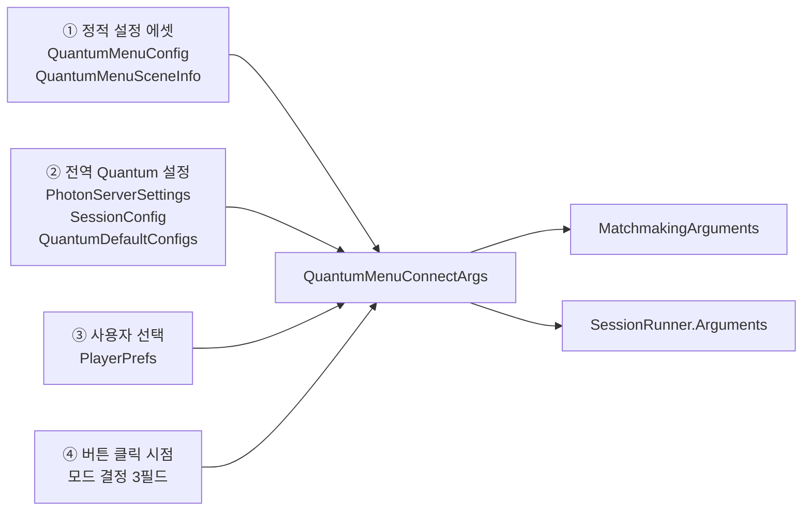
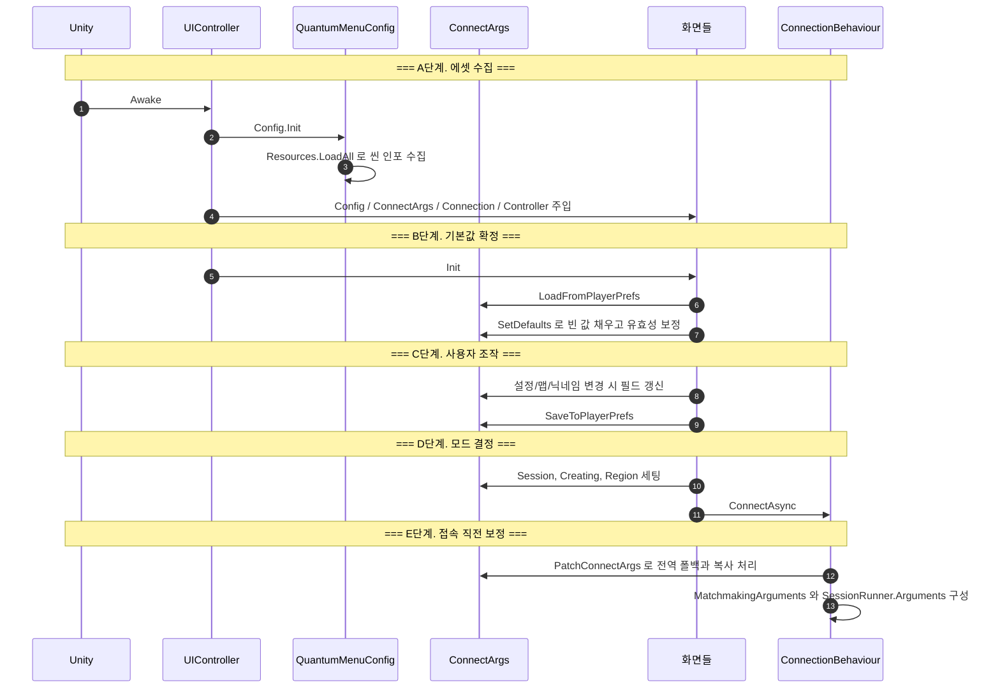

# QuantumMenuConnectArgs는 어떻게 채워지는가 — 설정 수집과 값 결정 절차

Photon Quantum 샘플 메뉴가 **설정 에셋을 수집하고 `QuantumMenuConnectArgs`의 각 필드를 결정하는 과정**만 따로 떼어 설명합니다. 접속 시퀀스 전체는 [매치메이킹부터 시뮬레이션 시작까지](quantum-menu-connection-guide.md)를, UI 배선은 [GUI 구조와 이벤트 배선](quantum-menu-gui-guide.md)을 참고하세요.

---

## 0. 값의 출처는 네 군데다

`QuantumMenuConnectArgs`는 접속에 필요한 모든 옵션이 모이는 **단 하나의 객체**입니다. `QuantumMenuUIController`가 하나만 들고 있고, 모든 화면이 같은 인스턴스를 공유합니다.



중요한 것은 **네 출처가 서로 다른 시점에 개입한다**는 점입니다. 순서를 알아야 "왜 내가 넣은 값이 덮어써졌는지"를 설명할 수 있습니다.

---

## 1. 전체 타임라인



각 단계를 순서대로 봅니다.

---

## 2. A단계 — 설정 에셋 수집

시작점은 [QuantumMenuUIController.Awake()](../Assets/Photon/QuantumMenu/Runtime/QuantumMenuUIController.cs:52)입니다.

```csharp
foreach (var screen in _screens) {
  screen.Config = _config;      // 인스펙터에 물린 QuantumMenuConfig 에셋
  screen.Config.Init();         // ← 여기서 에셋을 수집한다
  screen.Connection = Connection;
  screen.ConnectionArgs = ConnectArgs;
  screen.Controller = this;
}
```

`Config.Init()`이 화면 개수만큼 반복 호출되는 점에 주목하세요. 같은 에셋에 대해 매번 목록을 다시 만듭니다. 동작에는 문제가 없지만 의도된 설계라기보다 부작용에 가깝습니다.

### `QuantumMenuConfig.Init()`이 하는 일

[QuantumMenuConfig.cs:97](../Assets/Photon/QuantumMenu/Runtime/QuantumMenuConfig.cs:97)

```csharp
public void Init() {
  // 1. Resources 폴더 전체에서 QuantumMenuSceneInfo 에셋을 긁어모은다
  AvailableSceneAssets = Resources.LoadAll<QuantumMenuSceneInfo>("").ToList();

  // 2. 구식 _availableScenes 리스트를 ScriptableObject 인스턴스로 변환해 뒤에 붙인다
  AvailableSceneAssets.AddRange(AvailableScenes.Select(s => {
    var info = ScriptableObject.CreateInstance<QuantumMenuSceneInfo>();
    JsonUtility.FromJsonOverwrite(JsonUtility.ToJson(s), info);
    return info;
  }));

  // 3. 2개 이상이면 표시 이름으로 정렬
  if (AvailableSceneAssets.Count > 1)
    AvailableSceneAssets.Sort((a, b) => string.Compare(a.Name, b.Name));
}
```

핵심은 **경로 지정이 없다**는 것입니다. `Resources.LoadAll<T>("")`는 **모든 `Resources` 폴더**를 뒤집니다. 맵을 메뉴에 노출하려면 에셋을 `Resources` 아래 아무 데나 두면 되고, 반대로 **`Resources`에 있는 `QuantumMenuSceneInfo`는 자동으로 전부 목록에 들어갑니다.**

### 씬 인포 에셋이 들고 있는 것

| 필드 | 용도 |
|---|---|
| `Name` | 화면에 표시할 이름. 비면 `SceneName` 사용 |
| `ScenePath` | Unity 씬 에셋 경로. **Build Settings에 포함되어 있어야 함** |
| `SceneName` | `ScenePath`의 파일명 (읽기 전용). 실제로 로드할 씬 이름 |
| `Preview` | 썸네일 스프라이트 |
| `IsHidden` | "이 씬 쓰지 말 것" 플래그 |
| `RuntimeConfig` | **Map / SimulationConfig / SystemsConfig / Seed** — 시뮬레이션의 핵심 설정 |

> **주의**: `Init()`은 `IsHidden`을 **검사하지 않습니다.** 플래그를 켜도 목록에서 빠지지 않습니다. 숨기려면 에셋을 `Resources` 밖으로 옮기는 수밖에 없습니다.

### 이 프로젝트의 실제 상태

`YggdrasillMenuConfig.asset`은 **두 경로 모두**에 같은 맵을 갖고 있습니다.

| 출처 | 표시 이름 | Map ID |
|---|---|---|
| `Resources/Maps/MultiplayPrototype_QuantumMenuSceneInfo.asset` | `MultiplayPrototype` | `363481078872077106` |
| 구식 `_availableScenes[0]` | `Multiplay Prototype` | `363481078872077106` |

**목록에 같은 맵이 두 번 나타납니다.** 이름이 달라 조회는 충돌하지 않고 `RuntimeConfig`도 동일해서 어느 쪽이 선택되든 결과는 같지만, 정렬 후 `AvailableSceneAssets[0]`이 무엇이 될지는 문화권별 문자열 비교에 달려 있어 자명하지 않습니다. **구식 `_availableScenes`를 비우는 것을 권합니다.**

---

## 3. B단계 — PlayerPrefs 로드와 기본값 확정

`Controller.Awake()`가 주입을 마친 뒤 각 화면의 `Init()`을 부릅니다. 이 중 [QuantumMenuUIMain.Init()](../Assets/Photon/QuantumMenu/Runtime/QuantumMenuUIMain.cs:99)만이 실제로 값을 채웁니다.

```csharp
ConnectionArgs.LoadFromPlayerPrefs();   // 지난번 선택 복원
ConnectionArgs.SetDefaults(Config);     // 빈 값 채우고 유효성 보정
```

**메인 화면이 이 두 줄의 유일한 주인입니다.** 메인 화면을 직접 만든 것으로 교체한다면 반드시 옮겨와야 합니다 — 빠뜨리면 `ConnectArgs.Scene`이 null이라 접속 시점에 `NullReferenceException`이 납니다.

### 3-1. `LoadFromPlayerPrefs()` — 5개 필드만 복원

접두어는 `Photon.Menu.` 입니다.

| PlayerPrefs 키 | 필드 | 타입 | 미설정 시 값 |
|---|---|---|---|
| `Photon.Menu.Username` | `Username` | string | `""` |
| `Photon.Menu.Region` | `PreferredRegion` | string | `""` |
| `Photon.Menu.AppVersion` | `AppVersion` | string | `""` |
| `Photon.Menu.MaxPlayerCount` | `MaxPlayerCount` | int | `0` |
| `Photon.Menu.SceneName` | `SceneName` | string | `""` |

**저장되지 않는 것**과 대비하면 성격이 분명해집니다.

| 저장됨 — 사용자의 취향 | 저장 안 됨 (`[NonSerialized]`) — 이번 접속에서만 유효 |
|---|---|
| `Username`, `PreferredRegion`, `AppVersion`, `MaxPlayerCount`, `SceneName` | `Session`, `Region`, `Creating`, `RuntimeConfig`, `AuthValues`, `Client`, `Reconnecting`, `ReconnectInformation`, `QuantumClientId` |

`PreferredRegion`(사용자가 고른 선호 리전)과 `Region`(이번에 실제로 접속할 리전)이 **다른 필드**라는 점이 중요합니다. 전자는 저장되고 후자는 매번 새로 정해집니다.

### 3-2. `SetDefaults(config)` — 다섯 가지 보정 규칙

[QuantumMenu.Common.cs:130](../Assets/Photon/QuantumMenu/Runtime/QuantumMenu.Common.cs:130). 값이 없거나 **더 이상 설정에 존재하지 않는 값이면** 되돌립니다.

| # | 대상 | 규칙 | 이 프로젝트에서 첫 실행 시 결과 |
|---|---|---|---|
| 0 | `Session`, `Creating` | 무조건 `null` / `false`로 초기화 | `null`, `false` |
| 1 | `AppVersion` | `MachineId`도 아니고 `AvailableAppVersions`에도 없으면 → `MachineId` | **`null`** (아래 주의) |
| 2 | `PreferredRegion` | `AvailableRegions`에 없으면 → `""` | `""` (= 베스트 리전) |
| 3 | `MaxPlayerCount` | `0` 이하이거나 `Config.MaxPlayerCount` 초과면 → `Config.MaxPlayerCount` | `6` |
| 4 | `Username` | 비어 있으면 → `Player` + 코드 생성기의 3글자 | 예: `PlayerK7Q` |
| 5 | `Scene` | `SceneName`과 일치하는 에셋을 찾고, 없으면 → `AvailableSceneAssets[0]` | 목록 첫 항목 |

> **주의 — 첫 실행에서 `AppVersion`이 `null`이 됩니다.**
> `YggdrasillMenuConfig`의 `_machineId`는 비어 있어 `Config.MachineId`가 `null`입니다. PlayerPrefs가 없으면 `AppVersion`은 `""`인데, 이는 `MachineId`(null)와도 다르고 `AvailableAppVersions`(`["1.0"]`)에도 없으므로 규칙 1이 발동해 **`null`이 대입됩니다.** 설정 화면에서 값을 한 번 바꾸기 전까지 `AppVersion = null`로 접속하게 됩니다.
> 이것이 "AppVersion을 `Application.version`에 고정하려면 **접속 직전에** 덮어써야 한다"는 결론의 근거 중 하나입니다.

`Scene`은 단순 필드가 아니라 프로퍼티라서, 대입하면 `SceneName`도 함께 갱신됩니다.

```csharp
public QuantumMenuSceneInfo Scene {
  get => _scene;
  set { _scene = value; SceneName = value.NameOrSceneName; }   // ← 짝으로 움직인다
}
```

---

## 4. C단계 — 화면이 되쓰는 값

사용자가 UI를 조작하면 해당 화면이 `ConnectArgs`를 갱신하고 **즉시 `SaveToPlayerPrefs()`를 호출**합니다.

| 화면 | 트리거 | 갱신하는 필드 |
|---|---|---|
| `QuantumMenuUIMain` | 닉네임 입력 완료 | `Username` |
| `QuantumMenuUIScenes` | 맵 드롭다운 변경 | `Scene` (→ `SceneName` 동반) |
| `QuantumMenuUISettings` | 어떤 컨트롤이든 변경 | `MaxPlayerCount`, `PreferredRegion`, `AppVersion` |

`QuantumMenuUISettings.SaveChanges()`의 첫 줄이 이 구조의 방어 장치입니다.

```csharp
protected virtual void SaveChanges() {
  if (IsShowing == false) return;   // 화면이 아직 안 켜졌으면 무시
```

`Show()`에서 드롭다운 옵션 목록을 교체할 때 `onValueChanged`가 튀어 **UI를 그리는 행위가 데이터를 덮어쓰는 것**을 막습니다. 같은 이유로 `Show()`는 값을 넣을 때 `SetValueWithoutNotify` / `SetTextWithoutNotify`를 일관되게 씁니다.

---

## 5. D단계 — 버튼이 정하는 모드 3필드

접속 방식은 딱 세 필드로 결정됩니다. 각 진입점이 `ConnectAsync` **직전에** 세팅합니다.

| 진입점 | `Session` | `Creating` | `Region` |
|---|---|---|---|
| 퀵 플레이 | `null` | `false` | `PreferredRegion` |
| 파티 생성 | 새로 만든 파티 코드 | `true` | 리전 목록에서 선택 |
| 파티 참가 | 입력한 코드 | `false` | 코드에서 디코드 |
| 재접속 | `null` | `false` | 저장된 재접속 정보 |

이 세 값이 나중에 `MatchmakingArguments.RoomName` / `CanOnlyJoin` / `PhotonSettings.FixedRegion`으로 번역됩니다.

`QuantumMenuUIMain.Show()`에 있는 한 줄도 이 단계의 일부입니다.

```csharp
// 메인 화면에 돌아올 때마다 실제 리전을 지운다
ConnectionArgs.Region = null;
```

`Region`은 온라인 모드로 넘어갈 때만 채워지는 일회성 값이라는 뜻입니다.

---

## 6. E단계 — `PatchConnectArgs()`, 접속 직전 보정

여기가 마지막 관문입니다. [QuantumMenuConnectionBehaviourSDK.cs:379](../Assets/Photon/QuantumMenu/Runtime/QuantumMenuConnectionBehaviourSDK.cs:379)의 `private static` 메서드로, `ConnectAsyncInternal`의 **첫 줄**에서 호출됩니다.

다섯 가지 일을 합니다.

### 6-1. 전역 설정 폴백

```csharp
if (connectArgs.ServerSettings == null) connectArgs.ServerSettings = PhotonServerSettings.Global;
if (connectArgs.SessionConfig  == null) connectArgs.SessionConfig  = QuantumDeterministicSessionConfigAsset.Global;
```

인스펙터에서 비워 두면 전역 에셋이 자동으로 들어옵니다. **비워 두는 것이 정상 사용법**입니다.

### 6-2. 인원수 클램프

```csharp
connectArgs.MaxPlayerCount = Math.Min(connectArgs.MaxPlayerCount, Input.MaxCount);
```

`Input.MaxCount`는 Quantum DSL이 생성한 상수입니다. `QuantumMenuConfig._maxPlayers`를 아무리 크게 잡아도 시뮬레이션이 지원하는 한도를 넘을 수 없습니다.

### 6-3. `RuntimeConfig` 깊은 복사 — 가장 중요한 단계

```csharp
connectArgs.RuntimeConfig = JsonUtility.FromJson<RuntimeConfig>(
                              JsonUtility.ToJson(connectArgs.Scene.RuntimeConfig));
```

**`ConnectArgs.RuntimeConfig`는 사용자가 채우는 값이 아닙니다.** 매 접속마다 **선택된 씬 인포 에셋의 `RuntimeConfig`로 통째로 덮어써집니다.** 인스펙터나 코드에서 미리 설정해 두어도 여기서 사라집니다.

JSON 왕복으로 복사하는 이유는 **에셋 원본 오염 방지**입니다. `RuntimeConfig`는 클래스라서 참조를 그대로 쓰면 아래의 시드 재설정이 `Resources`의 `.asset` 파일을 건드리게 되고, 에디터에서는 그 변경이 디스크에 남을 수 있습니다.

### 6-4. 시드 재설정과 SimulationConfig 폴백

```csharp
if (connectArgs.RuntimeConfig.Seed == 0)
  connectArgs.RuntimeConfig.Seed = Guid.NewGuid().GetHashCode();

if (connectArgs.RuntimeConfig.SimulationConfig.Id.IsValid == false
    && QuantumDefaultConfigs.TryGetGlobal(out var defaultConfigs))
  connectArgs.RuntimeConfig.SimulationConfig = defaultConfigs.SimulationConfig;
```

에셋의 `Seed`를 `0`으로 두면 **매 게임 다른 난수**가 됩니다. 고정된 시드로 재현 가능한 게임을 원하면 에셋에 0이 아닌 값을 넣으세요.

### 6-5. 닉네임 주입과 인증값 생성

```csharp
if (string.IsNullOrEmpty(connectArgs.Username) == false && connectArgs.RuntimePlayers?.Length > 0)
  connectArgs.RuntimePlayers[0].PlayerNickname = connectArgs.Username;

if (connectArgs.AuthValues == null || (인증 타입 None && UserId 비어 있음)) {
  connectArgs.AuthValues ??= new AuthenticationValues();
  connectArgs.AuthValues.UserId = $"{connectArgs.Username}({new System.Random().Next(99999999):00000000}";
}
```

`Username`은 **UI 표시용 문자열이자 시뮬레이션에 들어가는 `RuntimePlayer.PlayerNickname`**입니다. 항상 0번 플레이어에만 주입되므로, 로컬 멀티플레이어를 쓴다면 나머지는 직접 채워야 합니다.

`UserId`에 난수를 붙이는 이유는 Photon이 **같은 `UserId`로 같은 방에 두 번 들어오는 것을 막기** 때문입니다. 한 PC에서 클라이언트 두 개를 띄우는 로컬 테스트가 이것 없이는 불가능합니다.

---

## 7. 전역 설정 에셋 3종

`PatchConnectArgs`가 참조하는 전역 에셋들은 모두 `QuantumGlobalScriptableObject`이며 기본 경로가 정해져 있습니다.

| 클래스 | 기본 경로 | 무엇을 담는가 |
|---|---|---|
| `PhotonServerSettings` | `Assets/QuantumUser/Resources/PhotonServerSettings.asset` | AppId, 프로토콜, `PlayerTtl`, `EmptyRoomTtl`, CRC |
| `QuantumDeterministicSessionConfigAsset` | `Assets/QuantumUser/Resources/SessionConfig.asset` | 틱레이트, 입력 지연, 롤백, 체크섬 |
| `QuantumDefaultConfigs` | `Assets/QuantumUser/Resources/QuantumDefaultConfigs.asset` | 기본 `SimulationConfig` 등 (씬이 지정 안 했을 때의 폴백) |

이 프로젝트는 세 에셋 모두 기본 경로에 존재합니다.

---

## 8. 최종 소비 — 어느 필드가 어디로 가는가

`PatchConnectArgs`가 끝나면 `ConnectArgs`는 두 구조체로 번역됩니다.

### `MatchmakingArguments` (Photon 매치메이킹)

| 대상 필드 | 출처 |
|---|---|
| `PhotonSettings` | `ServerSettings.AppSettings` 복사본 + `AppVersion` + `FixedRegion = Region` |
| `RoomName` | `Session` |
| `CanOnlyJoin` | `Session`이 있고 `Creating == false` |
| `MaxPlayers` | `MaxPlayerCount` |
| `PluginName` | `PhotonPluginName` (기본 `"QuantumPlugin"`) |
| `PlayerTtlInSeconds` / `EmptyRoomTtlInSeconds` / `EnableCrc` | `ServerSettings` |
| `AuthValues` | `AuthValues` |
| `NetworkClient` | `Client` (재접속용, 보통 null) |
| `ReconnectInformation` | `ReconnectInformation` |

### `SessionRunner.Arguments` (Quantum 시뮬레이션)

| 대상 필드 | 출처 |
|---|---|
| `RuntimeConfig` | `RuntimeConfig` (= 6-3에서 만든 복사본) |
| `SessionConfig` | `SessionConfig.Config` 또는 전역 기본값 |
| `PlayerCount` | `MaxPlayerCount` |
| `ClientId` | `QuantumClientId` → `Client.UserId` → 새 GUID 순 |
| `StartGameTimeoutInSeconds` | `StartGameTimeoutInSeconds` |
| `DeltaTimeType` / `RecordingFlags` / `InstantReplaySettings` / `GameFlags` | 동명 필드 |
| `Communicator` | `new QuantumNetworkCommunicator(Client)` |

`RuntimePlayers`만은 인자 구조체를 거치지 않고, 시뮬레이션이 시작된 **뒤에** 별도로 들어갑니다.

```csharp
for (int i = 0; i < connectArgs.RuntimePlayers.Length; i++)
  Runner.Game.AddPlayer(i, connectArgs.RuntimePlayers[i]);
```

---

## 9. 필드 전수표 — 누가, 언제 채우는가

| 필드 | 채우는 주체 | 시점 | PlayerPrefs |
|---|---|---|---|
| `Username` | `SetDefaults` / 메인 화면 | B / C | 저장 |
| `PreferredRegion` | `SetDefaults` / 설정 화면 | B / C | 저장 |
| `AppVersion` | `SetDefaults` / 설정 화면 | B / C | 저장 |
| `MaxPlayerCount` | `SetDefaults` / 설정 화면 → `PatchConnectArgs`가 클램프 | B / C / E | 저장 |
| `SceneName` | `Scene` 프로퍼티 setter가 동반 갱신 | B / C | 저장 |
| `Scene` | `SetDefaults` / 맵 선택 화면 | B / C | — |
| `Session` | 버튼 핸들러 | D | — |
| `Creating` | 버튼 핸들러 | D | — |
| `Region` | 버튼 핸들러 (메인 화면 진입 시 `null`로 리셋) | D | — |
| `RuntimeConfig` | **`PatchConnectArgs`가 씬 에셋에서 덮어씀** | E | — |
| `ServerSettings` | 인스펙터 또는 전역 폴백 | E | — |
| `SessionConfig` | 인스펙터 또는 전역 폴백 | E | — |
| `AuthValues` | 없으면 `PatchConnectArgs`가 생성 | E | — |
| `RuntimePlayers` | 인스펙터. `[0].PlayerNickname`만 E단계에서 주입 | 인스펙터 / E | — |
| `PhotonPluginName` | 인스펙터 (기본 `"QuantumPlugin"`) | 인스펙터 | — |
| `StartGameTimeoutInSeconds` | 인스펙터 (기본 10) | 인스펙터 | — |
| `ShutdownFlags` / `RecordingFlags` / `InstantReplaySettings` / `DeltaTimeType` | 인스펙터 | 인스펙터 | — |
| `Client` / `Reconnecting` / `ReconnectInformation` / `QuantumClientId` | 재접속 경로에서만 | D | — |

---

## 10. 실무에서 걸리는 지점

| 상황 | 원인 | 대응 |
|---|---|---|
| `ConnectArgs.Scene`이 null → 접속 시 NRE | 메인 화면의 `Init()`에서 `SetDefaults(Config)`를 안 부름 | 메인 화면을 교체했다면 두 줄을 반드시 이식 |
| 코드로 넣은 `RuntimeConfig`가 무시됨 | E단계에서 씬 에셋 값으로 덮어써짐 | `OnConnect` 훅에서 `PatchConnectArgs` **이후에** 수정 |
| 맵 목록에 원치 않는 항목이 뜸 | `Resources` 아래 모든 `QuantumMenuSceneInfo`가 자동 수집됨 | 에셋을 `Resources` 밖으로 이동. `IsHidden`은 효과 없음 |
| 같은 맵이 두 번 보임 | `_availableScenes`(구식)와 `Resources` 에셋이 중복 | `_availableScenes`를 비울 것 |
| 첫 실행에서 `AppVersion`이 null | `MachineId`가 비어 있고 저장값이 목록에 없음 (3-2 규칙 1) | 접속 직전에 명시적으로 대입 |
| 인스펙터에서 바꾼 `ConnectArgs`가 반영 안 됨 | 프리팹 YAML에 옛 이름 `DefaultConnectionArgs`로 직렬화된 데이터가 남아 있음 | 인스펙터에서 다시 입력하고 저장 |
| 매번 같은 난수 결과 | 씬 인포 에셋의 `Seed`가 0이 아님 | 0으로 두면 매 게임 재추첨 |
| 한 PC에서 두 클라이언트가 같은 방에 못 들어감 | `UserId` 중복 | E단계의 난수 `UserId` 생성 로직을 우회하지 말 것 |
| 설정 화면 드롭다운을 만졌더니 값이 초기화됨 | `SaveChanges`가 모든 필드를 한꺼번에 다시 씀 | 의도된 동작. 부분 갱신이 필요하면 `SaveChangesUser()` 활용 |
