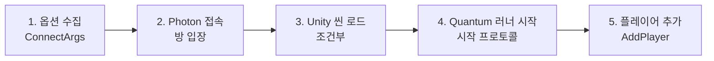
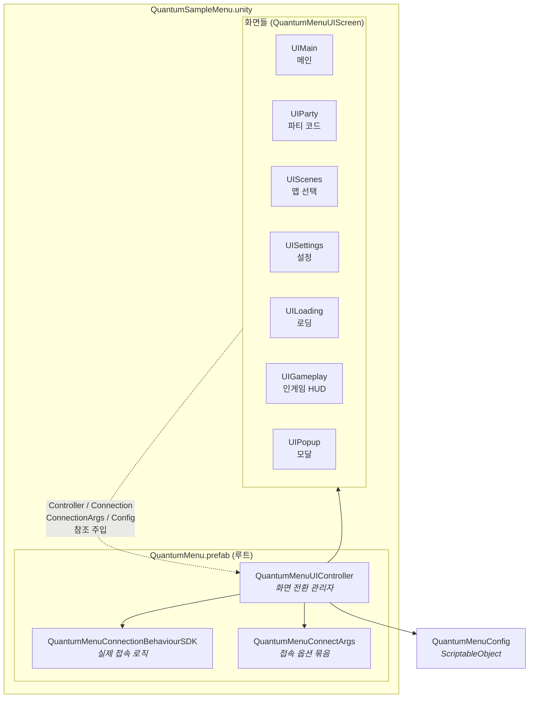
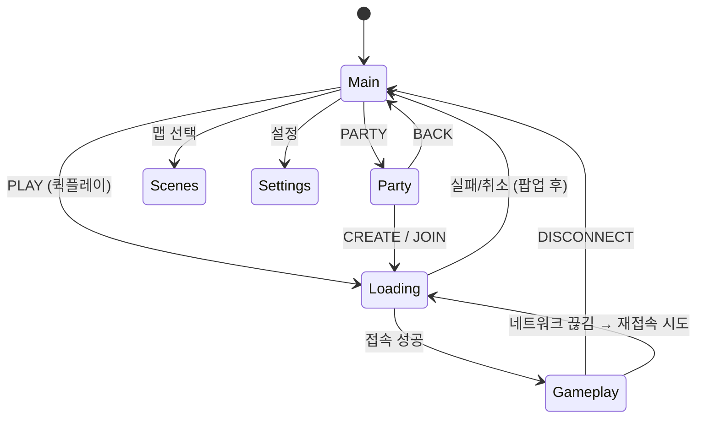
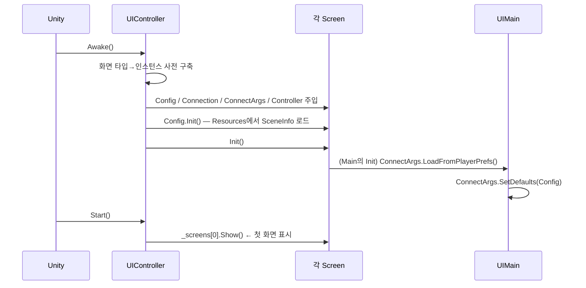
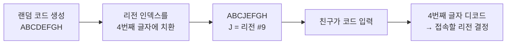
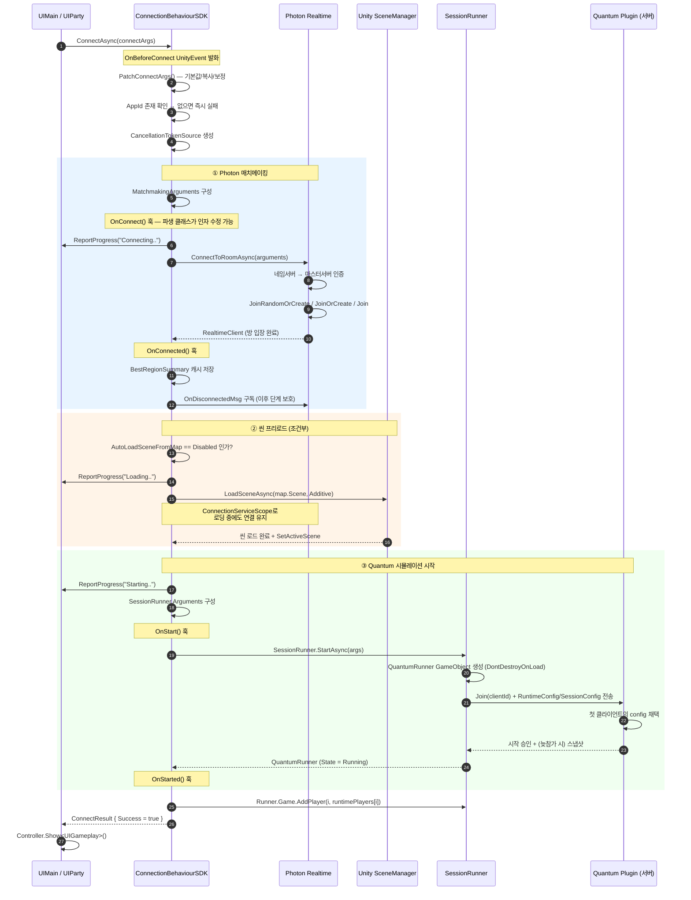
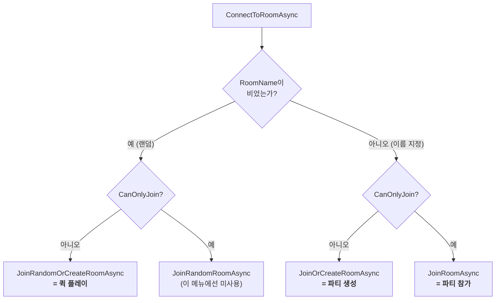
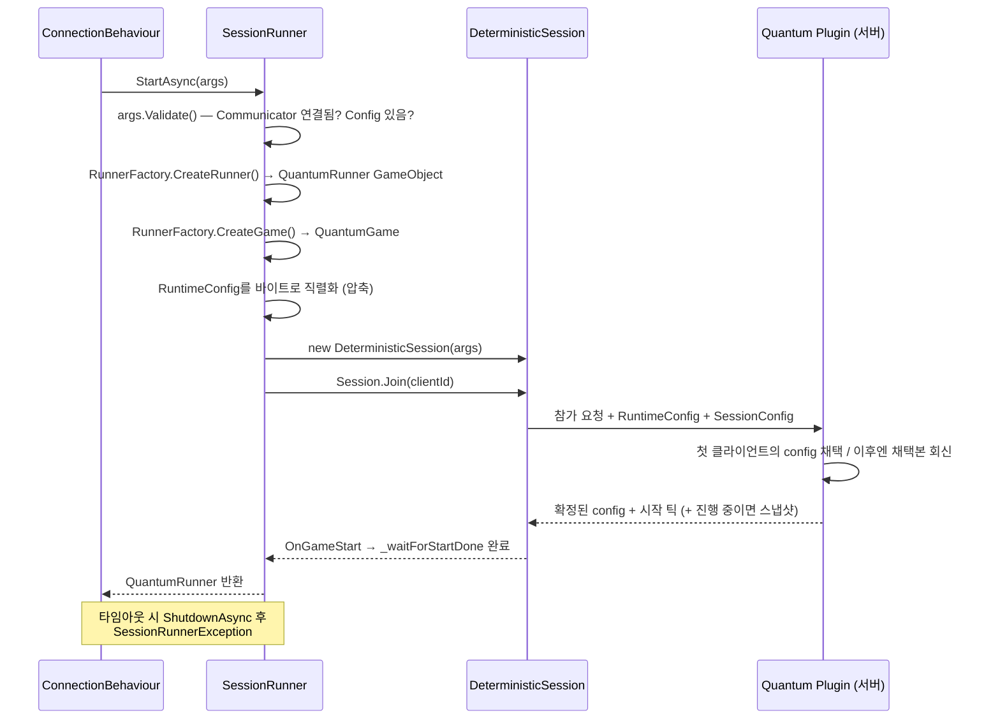
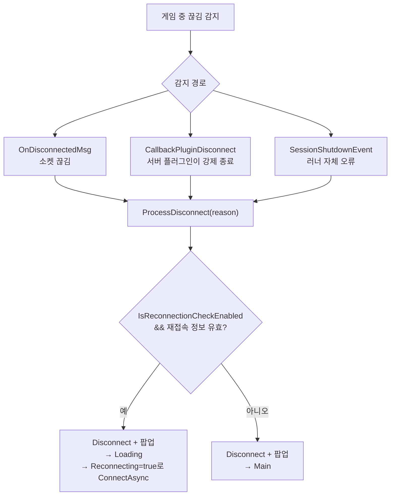

# Photon Quantum 메뉴 — 매치메이킹부터 시뮬레이션 시작까지

`Assets/Photon/QuantumMenu/QuantumSampleMenu.unity` 씬에서 **버튼 하나를 눌렀을 때 실제로 무슨 일이 일어나는지**를 처음부터 끝까지 따라가는 문서입니다. Claude code로 작성.

---

## 0. 30초 요약

플레이어가 **PLAY** 버튼을 누르면 다음 다섯 단계가 하나의 `async` 메서드 안에서 순서대로 일어납니다.



| 단계 | 담당 API | 끝나면 생기는 것 |
|---|---|---|
| 1 | `QuantumMenuConnectArgs` | 접속에 필요한 모든 옵션이 담긴 객체 |
| 2 | `MatchmakingExtensions.ConnectToRoomAsync()` | Photon 방에 들어간 `RealtimeClient` |
| 3 | `SceneManager.LoadSceneAsync()` | 맵의 Unity 씬 (조건부) |
| 4 | `SessionRunner.StartAsync()` | 결정론 시뮬레이션이 도는 `QuantumRunner` |
| 5 | `QuantumGame.AddPlayer()` | 시뮬레이션 안의 내 플레이어 슬롯 |

이 다섯 단계는 전부 [`QuantumMenuConnectionBehaviourSDK.ConnectAsyncInternal()`](../Assets/Photon/QuantumMenu/Runtime/QuantumMenuConnectionBehaviourSDK.cs:143) 한 메서드 안에 들어 있습니다. **이 파일 하나만 읽으면 접속 시퀀스 전체를 이해할 수 있습니다.**

---

## 1. 등장인물 — 클래스 지도

씬을 열면 `QuantumMenu.prefab` 하나가 들어 있고, 그 루트 게임오브젝트에 두 개의 핵심 컴포넌트가 붙어 있습니다.



| 클래스 | 파일 | 역할 |
|---|---|---|
| `QuantumMenuUIController` | [QuantumMenuUIController.cs](../Assets/Photon/QuantumMenu/Runtime/QuantumMenuUIController.cs) | 화면 목록을 들고 `Show<T>()`로 전환. 모든 화면에 참조를 주입. |
| `QuantumMenuUIScreen` | QuantumMenu.Common.cs | 모든 화면의 베이스. `Config` / `Connection` / `ConnectionArgs` / `Controller` 접근자 제공. |
| `QuantumMenuConnectionBehaviour` | QuantumMenu.Common.cs | 접속의 **추상 인터페이스**. `ConnectAsync` / `DisconnectAsync` / `RequestAvailableOnlineRegionsAsync`. |
| `QuantumMenuConnectionBehaviourSDK` | [QuantumMenuConnectionBehaviourSDK.cs](../Assets/Photon/QuantumMenu/Runtime/QuantumMenuConnectionBehaviourSDK.cs) | 위 추상 클래스의 **Quantum 구현체**. 이 문서의 주인공. |
| `QuantumMenuConnectArgs` | QuantumMenu.Common.cs + QuantumMenu.Sdk.cs | 접속 옵션 DTO. 공통 필드(Common)와 Quantum 전용 필드(Sdk)가 `partial`로 합쳐져 있음. |
| `QuantumMenuConfig` | [QuantumMenuConfig.cs](../Assets/Photon/QuantumMenu/Runtime/QuantumMenuConfig.cs) | 최대 인원, 선택 가능한 리전/앱버전/맵 목록 등 정적 설정. |

### 화면 간 흐름



> **주의**: 버튼은 Unity 인스펙터에서 `SendMessage()`로 `OnPlayButtonPressed` 같은 메서드 이름을 직접 호출하도록 배선되어 있습니다. 코드에서 `AddListener`를 찾아도 안 나오니 당황하지 마세요.

---

## 2. 앱 시작 시 초기화



핵심 두 줄은 [QuantumMenuUIMain.Init()](../Assets/Photon/QuantumMenu/Runtime/QuantumMenuUIMain.cs:99)에 있습니다.

```csharp
ConnectionArgs.LoadFromPlayerPrefs();   // 지난번 선택 복원
ConnectionArgs.SetDefaults(Config);     // 빠진 값 채우고 유효성 보정
```

`PlayerPrefs`에 저장되는 것은 **사용자가 고른 취향**뿐입니다 (`Photon.Menu.` 접두어).

| 저장됨 (`[HideInInspector]`) | 저장 안 됨 (`[NonSerialized]`) |
|---|---|
| `Username`, `PreferredRegion`, `AppVersion`, `MaxPlayerCount`, `SceneName` | `Session`, `Region`, `Creating`, `RuntimeConfig`, `AuthValues`, `Client`, `Reconnecting` |

`SetDefaults()`는 방어적으로 동작합니다 — 저장된 리전이 현재 `Config.AvailableRegions`에 없으면 비우고, `Username`이 비었으면 `Player` + 랜덤 3글자로 만들고, `SceneName`에 맞는 `QuantumMenuSceneInfo` 에셋을 찾아 `Scene`에 다시 물려줍니다.

---

## 3. 진입점 — 어디서 `ConnectAsync`가 호출되는가

접속을 시작하는 경로는 **네 가지**뿐입니다. 전부 마지막 세 줄이 똑같습니다.

```csharp
Controller.Show<QuantumMenuUILoading>();
var result = await Connection.ConnectAsync(ConnectionArgs);
await Controller.HandleConnectionResult(result, this.Controller);
```

| # | 경로 | 코드 위치 | `Session` | `Creating` | `Region` |
|---|---|---|---|---|---|
| 1 | **퀵 플레이** (PLAY) | [UIMain.OnPlayButtonPressed()](../Assets/Photon/QuantumMenu/Runtime/QuantumMenuUIMain.cs:192) | `null` | `false` | `PreferredRegion` |
| 2 | **파티 생성** (CREATE) | [UIParty.ConnectAsync(true)](../Assets/Photon/QuantumMenu/Runtime/QuantumMenuUIParty.cs:119) | 새 파티 코드 | `true` | 최적/선호 리전 |
| 3 | **파티 참가** (JOIN) | [UIParty.ConnectAsync(false)](../Assets/Photon/QuantumMenu/Runtime/QuantumMenuUIParty.cs:119) | 입력한 코드 | `false` | 코드에서 디코드 |
| 4 | **재접속** | [UIMain.RunReconnection()](../Assets/Photon/QuantumMenu/Runtime/QuantumMenu.Sdk.cs:398) / [UIGameplay.ProcessDisconnect()](../Assets/Photon/QuantumMenu/Runtime/QuantumMenu.Sdk.cs:324) | `null` | `false` | 저장된 정보 |

(추가로 Unity 6의 Multiplayer Play Mode에서는 [`QuantumMenuMppmJoinCommand`](../Assets/Photon/QuantumMenu/Runtime/QuantumMenu.Common.cs:568)가 호스트 에디터로부터 방 이름을 받아 동일한 경로를 탑니다.)

### 파티 코드가 리전을 품고 있는 이유

파티 화면은 좀 특별합니다. 화면에 **들어가는 순간** 백그라운드로 리전 목록을 요청합니다.

```csharp
// UIParty.Show()
_regionRequest = Connection.RequestAvailableOnlineRegionsAsync(ConnectionArgs);
```

이건 네임서버에 붙어서 각 리전의 핑을 재는 요청입니다. 왜 미리 하냐면 — **파티 코드 안에 리전 인덱스를 인코딩**하기 때문입니다.



Photon의 방은 **리전마다 완전히 분리**되어 있습니다. 서울 리전의 `ABCDEFGH` 방과 EU 리전의 `ABCDEFGH` 방은 남남입니다. 그래서 코드만으로는 부족하고, "어느 리전인지"를 코드 안에 실어 보내는 것입니다. 구현은 [QuantumMenuPartyCodeGenerator](../Assets/Photon/QuantumMenu/Runtime/QuantumMenuPartyCodeGenerator.cs:113)의 `EncodeRegion` / `DecodeRegion`이고, 기본값은 8글자 코드의 인덱스 4 위치입니다.

파티 생성 시 선호 리전이 비어 있으면 `FindBestAvailableOnlineRegionIndex()`가 **핑이 가장 낮은 리전**을 고릅니다.

---

## 4. 전체 접속 시퀀스 (핵심 다이어그램)



---

## 5. 단계별 상세

### 5-1. `PatchConnectArgs()` — 출발 전 점검

[코드](../Assets/Photon/QuantumMenu/Runtime/QuantumMenuConnectionBehaviourSDK.cs:379). 조용하지만 중요한 일을 다섯 가지 합니다.

```csharp
// 1) 전역 설정으로 폴백
if (connectArgs.ServerSettings == null) connectArgs.ServerSettings = PhotonServerSettings.Global;
if (connectArgs.SessionConfig  == null) connectArgs.SessionConfig  = QuantumDeterministicSessionConfigAsset.Global;

// 2) 인원수를 시뮬레이션이 지원하는 최대치로 클램프
connectArgs.MaxPlayerCount = Math.Min(connectArgs.MaxPlayerCount, Input.MaxCount);

// 3) 선택된 씬의 RuntimeConfig를 JSON 왕복으로 깊은 복사 (에셋 원본 오염 방지)
connectArgs.RuntimeConfig = JsonUtility.FromJson<RuntimeConfig>(
                              JsonUtility.ToJson(connectArgs.Scene.RuntimeConfig));

// 4) Seed가 0이면 매번 새로 뽑음 → 같은 맵이라도 게임마다 난수 다름
if (connectArgs.RuntimeConfig.Seed == 0)
    connectArgs.RuntimeConfig.Seed = Guid.NewGuid().GetHashCode();

// 5) 닉네임을 RuntimePlayers[0]에 주입
connectArgs.RuntimePlayers[0].PlayerNickname = connectArgs.Username;
```

그리고 인증값이 비어 있으면 `UserId`를 `"닉네임(12345678"` 형태로 자동 생성합니다. Photon은 **같은 `UserId`로 같은 방에 두 번 들어갈 수 없으므로**, 난수를 붙여 로컬 테스트에서 두 인스턴스가 충돌하지 않게 합니다.

> `Input.MaxCount`는 Quantum이 DSL에서 생성한 상수입니다. `QuantumMenuConfig._maxPlayers`가 아무리 커도 이 값을 넘길 수 없습니다.

### 5-2. Photon 매치메이킹 — `MatchmakingArguments`

`connectArgs`가 Photon이 이해하는 형태로 번역되는 지점입니다.

| `MatchmakingArguments` 필드 | 값의 출처 | 의미 |
|---|---|---|
| `PhotonSettings` | `ServerSettings.AppSettings` 복사본 + `AppVersion`, `FixedRegion` | AppId, 프로토콜, 접속할 리전 |
| `RoomName` | `connectArgs.Session` | 방 이름. **비어 있으면 랜덤 매치메이킹** |
| `CanOnlyJoin` | `Session 있음 && !Creating` | 방 생성 금지 여부 |
| `MaxPlayers` | `connectArgs.MaxPlayerCount` | 방 정원 |
| `PluginName` | `"QuantumPlugin"` | **서버 측 Quantum 플러그인 지정 — 필수** |
| `PlayerTtlInSeconds` | `ServerSettings` | 나간 플레이어 슬롯을 몇 초 남길지 (재접속용) |
| `EmptyRoomTtlInSeconds` | `ServerSettings` | 빈 방을 몇 초 유지할지 |
| `AuthValues` | `connectArgs.AuthValues` | `UserId` 및 커스텀 인증 |
| `AsyncConfig` | Unity TaskFactory + 취소 토큰 | 모든 await가 **Unity 메인 스레드**에서 재개되게 함 |

#### 방을 잡는 네 가지 분기

`ConnectToRoomAsync()`는 `RoomName`과 `CanOnlyJoin` 두 값만 보고 호출할 Photon 오퍼레이션을 고릅니다.



- **퀵 플레이**: 빈 자리 있는 방에 아무데나 들어가고, 없으면 새로 만듭니다. 방 이름은 서버가 지어줍니다.
- **파티 생성**: 내가 만든 코드로 방을 만듭니다. 혹시 같은 코드가 이미 있으면 그냥 들어갑니다.
- **파티 참가**: 없는 방이면 **실패해야** 하므로 `JoinRoomAsync`. 오타를 쳤을 때 엉뚱한 빈 방이 생기는 걸 막습니다.

내부 순서는 항상 동일합니다.

```
ConnectUsingSettingsAsync()   ← 네임서버에서 리전 선택 → 마스터서버 인증
        ↓
Join*RoomAsync()              ← 마스터가 게임서버 주소 알려줌 → 게임서버 접속 → 방 입장
        ↓
ReconnectInformation.Set()    ← 방/리전/UserId/AppVersion을 PlayerPrefs에 저장
```

성공 시 반환값은 **방에 들어간 상태의 `RealtimeClient`**입니다. 실패는 예외로 던져집니다 (`DisconnectException`, `OperationException`, `AuthenticationFailedException` 등).

#### 접속 후 방어선

방에 들어간 직후 이 구독이 걸립니다.

```csharp
_disconnectSubscription = Client.CallbackMessage.ListenManual<OnDisconnectedMsg>(m => {
  _disconnectCause = m.cause;
  _cancellation.Cancel();      // ← 씬 로딩/러너 시작 중이어도 즉시 중단
});
```

3단계(씬 로드)와 4단계(러너 시작)는 수 초가 걸릴 수 있습니다. 그 사이에 소켓이 끊기면 이 콜백이 취소 토큰을 당겨서 뒷단계 전체를 접습니다.

### 5-3. 씬 프리로드 — 왜 조건부인가

```csharp
preloadMap = simulationConfigAsset.AutoLoadSceneFromMap == SimulationConfig.AutoLoadSceneFromMapMode.Disabled;
```

Quantum에서 맵의 Unity 씬을 로드하는 주체는 **둘 중 하나**입니다.

| `AutoLoadSceneFromMap` | 누가 씬을 로드하나 | 메뉴의 동작 |
|---|---|---|
| `Disabled` | **메뉴가** 미리 로드 | `preloadMap = true` → 여기서 `LoadSceneAsync` |
| `UnloadPreviousScene` / `Additive` 등 | **Quantum이** 시뮬레이션 시작 후 자동 로드 | 메뉴는 건드리지 않음 |

둘 다 하면 씬이 두 번 로드되므로 배타적으로 갈립니다. 코드 주석에도 경고가 있습니다 — 프리로드는 `RuntimeConfig`가 **바뀌지 않을 때만** 안전합니다. 랜덤 매치메이킹에서 다른 클라이언트가 먼저 방에 들어와 다른 맵의 `RuntimeConfig`를 채택했다면, 내가 미리 로드한 씬은 틀린 씬이 됩니다.

로딩 중에도 Photon 연결을 살려두기 위해 `ConnectionServiceScope`를 씁니다.

```csharp
using (new ConnectionServiceScope(Client)) {
    await SceneManager.LoadSceneAsync(map.Scene, LoadSceneMode.Additive);
    SceneManager.SetActiveScene(...);
}
```

Photon은 주기적으로 `Service()`를 호출해줘야 패킷을 주고받습니다. 씬 로딩이 프레임을 잡아먹는 동안 이걸 안 하면 서버가 클라이언트를 타임아웃 처리합니다. `ConnectionServiceScope`는 `using` 블록 동안 별도 태스크로 `Service()`를 계속 돌려줍니다.

### 5-4. Quantum 시뮬레이션 시작 — `SessionRunner.Arguments`

이 문서에서 가장 중요한 구조체입니다.

```csharp
var sessionRunnerArguments = new SessionRunner.Arguments {
  RunnerFactory     = QuantumRunnerUnityFactory.DefaultFactory,
  GameParameters    = QuantumRunnerUnityFactory.CreateGameParameters,
  ClientId          = ...,
  RuntimeConfig     = connectArgs.RuntimeConfig,
  SessionConfig     = connectArgs.SessionConfig.Config,
  GameMode          = DeterministicGameMode.Multiplayer,
  PlayerCount       = connectArgs.MaxPlayerCount,
  Communicator      = new QuantumNetworkCommunicator(Client),   // ← Photon과 Quantum의 접착점
  CancellationToken = _linkedCancellation.Token,
  StartGameTimeoutInSeconds = connectArgs.StartGameTimeoutInSeconds,
  OnShutdown        = OnSessionShutdown,
  // + RecordingFlags, InstantReplaySettings, DeltaTimeType, GameFlags
};
```

| 필드 | 설명 |
|---|---|
| `RunnerFactory` | 플랫폼 의존 객체 생성기. Unity 팩토리는 `QuantumRunner (Default)` **게임오브젝트를 만들고 `DontDestroyOnLoad`** 시킨 뒤, 거기 붙은 `QuantumRunnerBehaviour`가 매 프레임 `Session.Update()`를 돌립니다. |
| `GameParameters` | 콜백/이벤트 디스패처, 에셋 직렬화기, 리소스 매니저(`QuantumUnityDB.Global`). |
| `ClientId` | **Quantum 전용 비밀 식별자.** Photon `UserId`와 별개이며, 재접속 시 같은 플레이어 슬롯을 되찾는 열쇠입니다. 우선순위: `connectArgs.QuantumClientId` → `Client.UserId` → 새 GUID. |
| `RuntimeConfig` | **게임별 설정** — 맵, 시드, `SimulationConfig`, `SystemsConfig`. 모든 클라이언트가 자기 것을 보내고 **서버가 첫 번째로 받은 것을 채택**해 전원에게 배포합니다. |
| `SessionConfig` | **결정론 프로토콜 설정** — 틱레이트, 입력 지연, 롤백 윈도우, 체크섬 주기. 역시 서버가 하나를 채택합니다. |
| `GameMode` | `Multiplayer` / `Local` / `Replay` / `Spectating`. `Multiplayer`는 `Communicator`가 **연결된 상태**여야 하며, 아니면 `Validate()`가 예외를 던집니다. |
| `Communicator` | `QuantumNetworkCommunicator(Client)`. Quantum의 결정론 프로토콜 메시지를 Photon `RaiseEvent`로 실어 나릅니다. **이것이 2단계와 4단계를 잇는 유일한 다리입니다.** |
| `StartGameTimeoutInSeconds` | 시작 프로토콜 완료를 기다리는 **클라이언트 측** 타임아웃 (기본 10초). 큰 스냅샷이나 느린 웹훅이 있으면 늘려야 합니다. |
| `OnShutdown` | 러너가 죽을 때 호출. 여기서 `SessionShutdownEvent`로 중계되어 `UIGameplay`가 받습니다. |

#### `StartAsync()` 안에서 벌어지는 일



`Start()`(동기)와 `StartAsync()`(비동기)의 차이가 중요합니다.

- `Start()` — 러너 객체를 만들고 **즉시 반환**. 시뮬레이션은 아직 안 돌아갑니다.
- `StartAsync()` — 내부적으로 `WaitForStartAsync(timeout)`까지 기다려서 **실제로 시뮬레이션이 시작된 뒤** 반환. 메뉴는 이걸 씁니다.

시작이 타임아웃되면 `_waitForStartTimeout`이 취소를 걸고, 러너를 정리한 뒤 `SessionRunnerException("Session start timed out")`을 던집니다. 이때 **Photon 연결은 아직 살아 있다**는 점에 주의하세요 — 그래서 catch 블록에서 `CleanupAsync()`를 호출해 연결까지 정리합니다.

### 5-5. `AddPlayer` — 접속과 플레이어는 별개다

```csharp
for (int i = 0; i < connectArgs.RuntimePlayers.Length; i++) {
  Runner.Game.AddPlayer(i, connectArgs.RuntimePlayers[i]);
}
```

Quantum에서 **"방에 들어간 것"과 "시뮬레이션의 플레이어가 된 것"은 다른 사건**입니다.

- 시뮬레이션 시작 = 결정론 프로토콜에 합류. 아직 플레이어는 0명일 수도 있음.
- `AddPlayer(slot, RuntimePlayer)` = "나는 이 데이터를 가진 플레이어로 참가하겠다"는 **명시적 선언**.

이렇게 분리한 이유는 SDK 주석에 나와 있습니다 — **늦참가(late-join)를 단순하게 만들기 위해서**입니다. 관전자는 `AddPlayer`를 안 부르면 되고, 로컬 멀티플레이는 슬롯을 여러 번 부르면 됩니다. 기본 `RuntimePlayers` 배열은 원소 1개이므로 보통은 한 번만 호출됩니다.

`RuntimePlayer`는 게임이 정의하는 구조체입니다 (닉네임, 선택한 캐릭터 등). 압축 직렬화되어 전 클라이언트에게 브로드캐스트되고, 시뮬레이션 안에서 `frame.GetPlayerData(i)`로 읽힙니다 — `UIGameplay`의 플레이어 목록이 정확히 이 경로를 씁니다.

---

## 6. 실패했을 때

### `ConnectResult`

모든 경로가 예외 대신 이 객체를 반환합니다.

```csharp
public class ConnectResult {
  public bool Success;
  public int  FailReason;           // ConnectFailReason 상수
  public int  DisconnectCause;      // Photon DisconnectCause
  public string DebugMessage;       // 팝업에 그대로 표시됨
  public bool CustomResultHandling; // true면 메뉴가 아무 처리도 안 함
  public Task WaitForCleanup;       // 정리 완료를 기다릴 태스크
}
```

| 코드 | 상수 | 언제 |
|---|---|---|
| 1 | `UserRequest` | 로딩 화면에서 취소 버튼 |
| 2 | `ApplicationQuit` | 앱/에디터 종료 — **팝업 없이 조용히 종료** |
| 3 | `Disconnect` | 소켓 끊김 |
| 10 | `ConnectingFailed` | Photon 접속 실패 |
| 11 | `MapNotFound` | `RuntimeConfig.Map`에 해당하는 에셋 없음 |
| 12 | `LoadingFailed` | 씬 로드 실패 |
| 13 | `RunnerFailed` | 러너 시작 실패 (타임아웃 포함) |
| 14 | `PluginError` | 서버 Quantum 플러그인이 거부 |
| 15 | `NoAppId` | AppId 미설정 — Quantum Hub에서 설정 필요 |

### 처리 흐름

```csharp
// QuantumMenuUIController.HandleConnectionResult
if (result.CustomResultHandling) return;
if (result.Success)                       controller.Show<QuantumMenuUIGameplay>();
else if (FailReason != ApplicationQuit) { 팝업 표시 + WaitForCleanup 대기 → Show<UIMain>(); }
```

`WaitForCleanup`이 있는 이유: 씬 언로드나 러너 종료가 진행 중인데 메인 화면에서 곧바로 다시 접속을 시도하면 `"Connection instance still in use"` 예외가 납니다. 그래서 팝업을 띄우는 동안 정리를 **병렬로 기다립니다**.

### `CleanupAsync()`의 역순 해체

```
OnCleanup() 훅
  → 취소 토큰 / 구독 해제
  → Runner.ShutdownAsync()      (시뮬레이션 종료)
  → Client.DisconnectAsync()    (Photon 연결 종료)
  → SceneManager.UnloadSceneAsync()  (프리로드한 씬 제거)
```

앱 종료 중(`AsyncConfig.Global.IsCancellationRequested`)이면 await 없이 동기 버전(`Shutdown()` / `Disconnect()`)을 씁니다 — 종료 중에는 태스크가 재개되지 않기 때문입니다.

### 인게임 중 끊김과 재접속



재접속 정보(`QuantumReconnectInformation`)는 방 이름·리전·`UserId`·`AppVersion`·만료시각을 `PlayerPrefs`(`Quantum.ReconnectInformation`)에 저장하며, 기본 유효기간은 **20초**입니다. `Reconnecting = true`면 `ConnectToRoomAsync` 대신 `ReconnectToRoomAsync`가 호출되고, 이쪽은 훨씬 공격적입니다.

1. `ReconnectAndRejoinAsync()` — 10초 이내 끊김이면 가장 빠른 경로
2. 실패하면 재접속 후 `RejoinRoomAsync()` (`PlayerTtl > 0`일 때만)
3. `JoinFailedFoundActiveJoiner`면 1초 대기 후 재시도 (최대 10회)
4. `JoinFailedWithRejoinerNotFound`면 rejoin을 포기하고 일반 `JoinRoomAsync()`

> **이 프로젝트 주의**: `PhotonServerSettings.asset`의 `PlayerTtlInSeconds`가 **0**입니다. 즉 `CanRejoin == false`이므로 위 1·2단계(빠른 재접속·리조인)는 건너뛰고 항상 새 액터로 방에 다시 들어갑니다. 끊긴 플레이어의 Quantum 슬롯을 보존하려면 이 값을 올려야 합니다.

---

## 7. Photon / Quantum 용어 정리

| 용어 | 뜻 |
|---|---|
| **AppId** | Photon 대시보드에서 발급하는 앱 식별자. Quantum은 `AppIdQuantum`을 씁니다 (Realtime/Fusion용과 다름). |
| **AppVersion** | 같은 AppId 안에서 매치메이킹을 격리하는 문자열. 버전이 다르면 서로 만나지 않습니다. 개발 중에는 `MachineId`(머신별 GUID)를 넣어 **동료와 방이 섞이지 않게** 하는 용도로 자주 씁니다. |
| **Region** | `asia`, `eu`, `us`, `kr` 등 물리적 서버 위치. **리전이 다르면 방 목록도 완전히 분리**됩니다. |
| **Room** | 최대 인원과 커스텀 프로퍼티를 가진 메시지 라우팅 단위. Quantum 세션 하나 = Photon 방 하나. |
| **PlayerTtl** | 플레이어가 끊긴 뒤 슬롯을 유지하는 시간(ms). 0이면 즉시 제거되어 rejoin이 불가합니다. |
| **EmptyRoomTtl** | 마지막 인원이 나간 뒤 방을 유지하는 시간(ms). |
| **QuantumPlugin** | Photon 서버에서 도는 Quantum 전용 플러그인. 시작 프로토콜 중재, config 채택, 스냅샷 제공, 입력 릴레이를 담당합니다. `PluginName`으로 지정하지 않으면 Quantum 게임이 성립하지 않습니다. |
| **UserId vs ClientId** | `UserId`는 Photon 레벨 식별자(방 중복 입장 방지, `PublishUserId`로 공개). `ClientId`는 Quantum 레벨 비밀값(플레이어 슬롯 복구용). 기본적으로 같은 값을 쓰지만 **개념이 다릅니다.** |
| **RuntimeConfig** | 게임 인스턴스 단위 설정 — 맵, 시드, 시뮬레이션/시스템 config 참조. 서버가 하나로 통일. |
| **SessionConfig** (`DeterministicSessionConfig`) | 결정론 프로토콜 파라미터 — 틱레이트, 입력 지연, 롤백, 체크섬. 서버가 하나로 통일. |
| **SimulationConfig** | 물리/네비메시 등 시뮬레이션 튜닝값. `RuntimeConfig`가 참조하는 에셋. |
| **Communicator** | Quantum ↔ 전송 계층 추상화. `QuantumNetworkCommunicator`가 Photon 구현체. |
| **Snapshot** | 진행 중인 게임에 늦게 들어온 클라이언트에게 서버가 보내주는 프레임 상태. 크면 시작 타임아웃을 늘려야 합니다. |
| **MPPM** | Unity 6 Multiplayer Play Mode. 메인 에디터가 방 정보를 가상 플레이어에게 브로드캐스트해 자동 합류시킵니다. |

---

## 8. 이 프로젝트(Yggdrasill)의 실제 설정

| 항목 | 값 | 위치 |
|---|---|---|
| AppId (Quantum) | 설정됨 | `Assets/QuantumUser/Resources/PhotonServerSettings.asset` |
| `PlayerTtlInSeconds` | `0` | 위와 동일 — **rejoin 불가** |
| `EmptyRoomTtlInSeconds` | `0` | 위와 동일 |
| `EnableCrc` | `false` | 위와 동일 |
| 메뉴 설정 | `YggdrasillMenuConfig.asset` | 최대 6인, 리전 `asia`/`eu`/`sa`/`us`, AppVersion `1.0` |
| 맵 | `MultiplayPrototype` | `Assets/Scenes/MultiplayPrototype.unity` |
| 씬 정보 에셋 | `MultiplayPrototype_QuantumMenuSceneInfo.asset` | `Resources/Maps/` — `Config.Init()`이 `Resources.LoadAll`로 수집 |
| 파티 코드 | 8자리, 리전은 인덱스 4에 인코딩 | `QuantumMenuPartyCodeGenerator.asset` |

> `YggdrasillMenuConfig`는 구식 `_availableScenes` 리스트에도 같은 맵을 갖고 있습니다. `Config.Init()`이 이걸 `QuantumMenuSceneInfo` 인스턴스로 변환해 목록에 **추가**하므로, `Resources/Maps/`의 에셋과 합쳐져 같은 맵이 두 번 보일 수 있습니다. 정리하려면 `_availableScenes`를 비우는 쪽이 맞습니다.

---

## 9. 커스터마이징 지점

이 SDK는 **파일을 고치지 않고** 끼어들 자리를 여러 겹으로 열어 두었습니다.

### (a) 인스펙터 UnityEvent — 코드 없이

| 이벤트 | 시점 | 용도 |
|---|---|---|
| `OnBeforeConnect(QuantumMenuConnectArgs)` | `ConnectAsyncInternal` 진입 직전 | 커스텀 인증값 주입, 맵 강제 지정 |
| `OnBeforeDisconnect(int)` | 종료 직전 | 분석 로그 |
| `OnProgress(string)` | 각 단계 진입 시 | 기본 배선: `UILoading.SetStatusText` ("Connecting.." / "Loading.." / "Starting..") |

### (b) 파생 클래스 훅 — `QuantumMenuConnectionBehaviourSDK`를 상속

```csharp
protected virtual void OnConnect(QuantumMenuConnectArgs a, ref MatchmakingArguments args) { }
protected virtual void OnConnected(RealtimeClient client)     { }
protected virtual void OnStart(ref SessionRunner.Arguments a) { }
protected virtual void OnStarted(QuantumRunner runner)        { }
protected virtual void OnCleanup()                            { }
```

- 커스텀 로비/SQL 필터/방 프로퍼티 → `OnConnect`에서 `args.Lobby`, `args.SqlLobbyFilter`, `args.CustomProperties` 설정
- 리플레이 녹화 → `OnStart`에서 `args.RecordingFlags` 조정
- 시뮬레이션 시작 직후 카메라/HUD 바인딩 → `OnStarted`

### (c) `partial` 메서드 — 화면 로직 확장

각 화면은 `AwakeUser` / `InitUser` / `ShowUser` / `HideUser` `partial` 메서드를 노출합니다. SDK가 실제로 이 방식을 쓰고 있습니다 — [QuantumMenu.Sdk.cs](../Assets/Photon/QuantumMenu/Runtime/QuantumMenu.Sdk.cs)의 `QuantumMenuUIMain.ShowUser()`가 앱 시작 시 자동 재접속을 붙이는 식입니다. 같은 파일을 새로 만들어 `partial class`로 구현을 채우면 됩니다.

### (d) 화면 자체를 교체

`QuantumMenuUIController._screenLookup`은 **베이스 타입까지 등록**하므로, `QuantumMenuUIMain`을 상속한 `MyMain`을 프리팹에 붙여도 `Show<QuantumMenuUIMain>()`이 그대로 동작합니다.

---

## 10. 자주 겪는 문제

| 증상 | 원인 | 해결 |
|---|---|---|
| `"AppId missing"` 팝업 | `PhotonServerSettings.AppSettings.AppIdQuantum`이 비어 있음 | Quantum Hub에서 AppId 설정 |
| `"Connection instance still in use"` 예외 | 이전 접속의 `_cancellation`이 아직 살아 있음 | `HandleConnectionResult`가 `WaitForCleanup`을 기다리도록 유지. 커스텀 UI라면 직접 await 필요 |
| `"Session start timed out"` | 시작 프로토콜이 10초 내 미완료 (큰 스냅샷 / 느린 웹훅) | `ConnectArgs.StartGameTimeoutInSeconds` 상향. `SessionConfig.SessionStartTimeout`보다 커야 함 |
| `"Communicator connection required"` | `GameMode.Multiplayer`인데 클라이언트가 방에 없음 | Photon 단계가 완료된 뒤에 `StartAsync`를 부를 것 |
| 씬이 두 번 로드됨 | 메뉴 프리로드 + `AutoLoadSceneFromMap` 둘 다 켜짐 | `SimulationConfig.AutoLoadSceneFromMap`을 확인해 한쪽만 |
| 같은 PC 두 인스턴스가 서로 못 만남 | `AppVersion`이 `MachineId`이거나 리전 선택이 다름 | 설정 화면에서 AppVersion/Region 통일 |
| `"No valid scene to start found"` 경고 + PLAY 비활성 | `Resources` 아래에 `QuantumMenuSceneInfo` 에셋이 없음 | 맵의 SceneInfo 에셋을 `Resources` 폴더에 배치 |
| 방에는 들어갔는데 플레이어가 안 보임 | `AddPlayer`가 호출되지 않음 | `ConnectArgs.RuntimePlayers`가 비어 있지 않은지 확인 |

### 코드를 읽을 때 알아두면 좋은 두 가지 함정

1. **`QuantumMenuConnectionShutdownFlag`의 플래그 값이 어긋나 있습니다.** `[Flags]`가 붙어 있지만 명시적 값이 없어 `Disconnect = 0`, `ShutdownRunner = 1`, `UnloadScene = 2`가 됩니다. `CleanupAsync()`의 검사식이 `(_shutdownFlags & X) >= 0` 형태라 **항상 참**이므로, 실질적으로 정리 단계를 부분적으로 끄는 기능은 동작하지 않습니다. 선택적 정리가 필요하면 파생 클래스에서 직접 구현하세요.

2. **`QuantumMenu.prefab`에는 `DefaultConnectionArgs`라는 이름으로 직렬화된 데이터가 남아 있습니다.** 현재 `QuantumMenuUIController`의 필드명은 `ConnectArgs`이고 `FormerlySerializedAs`가 없으므로, 프리팹 YAML의 그 값들은 스크립트에 연결되지 않습니다. 인스펙터에서 값을 바꿨는데 반영이 안 되는 것처럼 보이면 이걸 의심해 보세요.

---

## 11. 최소 재현 코드 — 메뉴 없이 직접 붙이기

메뉴 UI 없이 같은 일을 하려면 이 정도면 됩니다. 위 문서 전체의 압축판입니다.

```csharp
using System;
using System.Threading.Tasks;
using Photon.Realtime;
using Quantum;
using UnityEngine;

public class MinimalConnect : MonoBehaviour {
  public RuntimeConfig RuntimeConfig;   // Map / SimulationConfig / SystemsConfig 설정 필요
  public RuntimePlayer Player = new RuntimePlayer();

  async void Start() {
    // ── ① Photon: 방에 들어간 RealtimeClient 얻기 ─────────────────
    var matchmaking = new MatchmakingArguments {
      PhotonSettings = PhotonServerSettings.Global.AppSettings,
      MaxPlayers     = 4,
      RoomName       = null,              // null = 랜덤 매치메이킹
      CanOnlyJoin    = false,             // 없으면 새로 만들어도 됨
      PluginName     = "QuantumPlugin",   // 반드시 지정
      UserId         = Guid.NewGuid().ToString(),
      AsyncConfig    = new AsyncConfig {
        TaskFactory = AsyncConfig.CreateUnityTaskFactory()   // await를 메인 스레드로
      },
    };
    var client = await MatchmakingExtensions.ConnectToRoomAsync(matchmaking);

    // ── ② Quantum: 시뮬레이션 시작 ───────────────────────────────
    if (RuntimeConfig.Seed == 0) RuntimeConfig.Seed = Guid.NewGuid().GetHashCode();

    var runner = (QuantumRunner)await SessionRunner.StartAsync(new SessionRunner.Arguments {
      RunnerFactory  = QuantumRunnerUnityFactory.DefaultFactory,
      GameParameters = QuantumRunnerUnityFactory.CreateGameParameters,
      ClientId       = client.UserId,
      RuntimeConfig  = RuntimeConfig,
      SessionConfig  = QuantumDeterministicSessionConfigAsset.DefaultConfig,
      GameMode       = DeterministicGameMode.Multiplayer,
      PlayerCount    = 4,
      Communicator   = new QuantumNetworkCommunicator(client),   // Photon ↔ Quantum 다리
      StartGameTimeoutInSeconds = 10f,
    });

    // ── ③ 플레이어로 참가 ────────────────────────────────────────
    runner.Game.AddPlayer(Player);
  }
}
```

빠진 것: 취소 처리, 예외 처리, 진행 상황 표시, 씬 프리로드, 재접속, 정리. 실제 메뉴 구현이 400줄인 이유가 바로 이것들입니다.

---

## 부록: 파일 찾아보기

| 알고 싶은 것 | 볼 파일 |
|---|---|
| 접속 시퀀스 전체 | [QuantumMenuConnectionBehaviourSDK.cs](../Assets/Photon/QuantumMenu/Runtime/QuantumMenuConnectionBehaviourSDK.cs) |
| 접속 옵션 필드 | [QuantumMenu.Sdk.cs](../Assets/Photon/QuantumMenu/Runtime/QuantumMenu.Sdk.cs) `QuantumMenuConnectArgs` |
| 화면 전환·에러 처리 | [QuantumMenuUIController.cs](../Assets/Photon/QuantumMenu/Runtime/QuantumMenuUIController.cs) |
| 퀵플레이 진입 | [QuantumMenuUIMain.cs](../Assets/Photon/QuantumMenu/Runtime/QuantumMenuUIMain.cs) |
| 파티 코드·리전 | [QuantumMenuUIParty.cs](../Assets/Photon/QuantumMenu/Runtime/QuantumMenuUIParty.cs), [QuantumMenuPartyCodeGenerator.cs](../Assets/Photon/QuantumMenu/Runtime/QuantumMenuPartyCodeGenerator.cs) |
| 인게임 끊김·재접속 | [QuantumMenu.Sdk.cs](../Assets/Photon/QuantumMenu/Runtime/QuantumMenu.Sdk.cs) `QuantumMenuUIGameplay` |
| Photon 매치메이킹 원본 | [MatchmakingExtensions.cs](../Assets/Photon/PhotonRealtime/Code/MatchmakingExtensions.cs) |
| `SessionRunner` 원본 | `Assets/Photon/Quantum/Simulation/QuantumSimulationCore.cs` (약 7750~8450행) |
| Unity 러너 팩토리 | `Assets/Photon/Quantum/Runtime/QuantumUnityRuntime.cs` `QuantumRunnerUnityFactory` |
