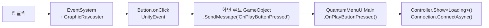
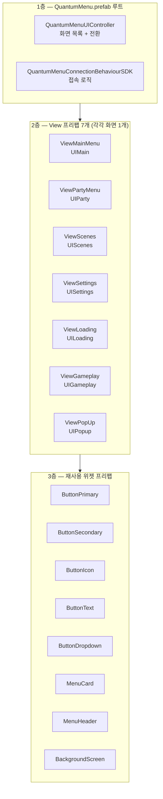
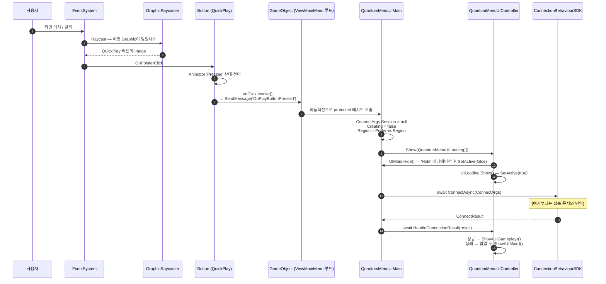
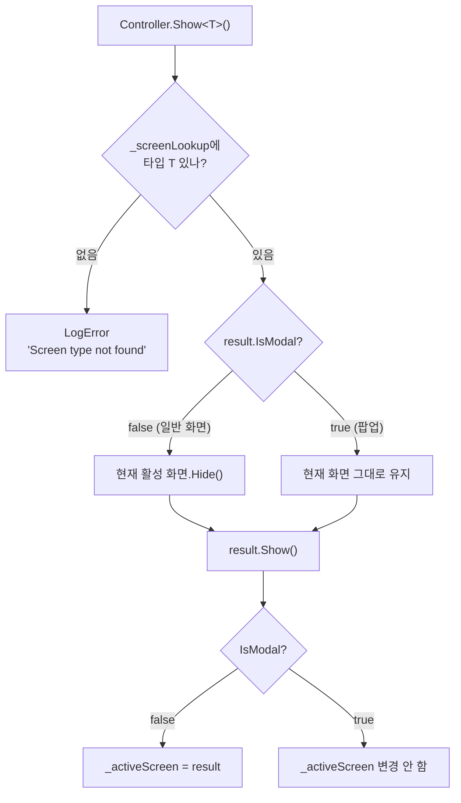
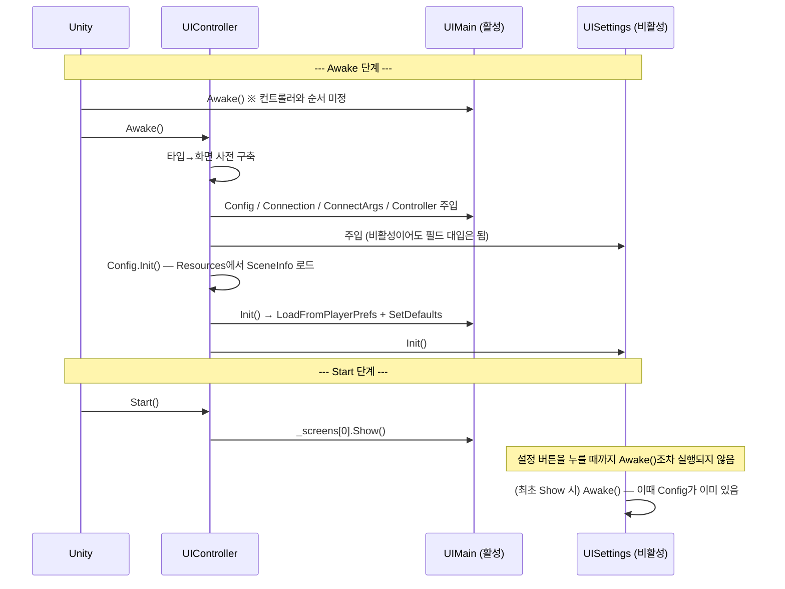
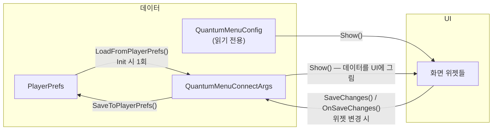

# Photon Quantum 메뉴 — GUI 구조와 이벤트 배선

`Assets/Photon/QuantumMenu/QuantumSampleMenu.unity` 씬의 **UI가 어떻게 조립되어 있고, 버튼 클릭이 어떤 경로로 코드까지 도달하는지**를 설명하는 문서입니다. 접속 로직 자체는 [매치메이킹부터 시뮬레이션 시작까지](quantum-menu-connection-guide.md)에서 다룹니다. 이 문서는 그 바로 앞 단계 — **"클릭이 `OnPlayButtonPressed()`에 닿기까지"** 를 다룹니다.

---

## 0. 30초 요약

이 메뉴의 GUI를 이해하는 열쇠는 딱 하나입니다.

> **모든 버튼은 `Button.onClick` → `GameObject.SendMessage("메서드이름")` 으로 배선되어 있다.**

인스펙터의 OnClick 슬롯에는 스크립트 메서드가 아니라 **`GameObject.SendMessage`** 가 등록되어 있고, 실제 호출할 메서드 이름은 **문자열 인자**로 들어갑니다. 그래서 코드에서 `onClick.AddListener`를 찾아도, 메서드에서 "참조 찾기"를 해도 아무것도 안 나옵니다.



---

## 1. 씬에는 사실 아무것도 없다

`QuantumSampleMenu.unity`를 열면 루트 오브젝트가 **셋뿐**입니다.

| 오브젝트 | 컴포넌트 | 설정값 |
|---|---|---|
| **Camera** | Camera | 배경용. 게임 진입 시 `QuantumMenuUIGameplay`가 꺼버립니다 (`_detectAndToggleMenuCamera`). |
| **Canvas** | Canvas / CanvasScaler / GraphicRaycaster | Screen Space - Overlay, 기준 해상도 **1920×1080**, Scale With Screen Size, Match = **0.75** (높이 우선) |
| **Event System** | EventSystem / **InputSystemUIInputModule** | 신 Input System 사용. 액션 에셋이 물려 있음 |

UI 본체는 Canvas의 자식으로 들어간 **`QuantumMenu.prefab` 인스턴스 하나**가 전부입니다. 씬을 뒤져도 UI 구조를 알 수 없고, **프리팹을 열어야** 보입니다.

> Match = 0.75는 "너비보다 높이 쪽에 더 맞춘다"는 뜻입니다. 세로로 긴 모바일 화면에서 UI가 잘리지 않도록 한 선택입니다.

---

## 2. 프리팹 3층 구조



**1층**: `QuantumMenu.prefab` 루트 GameObject 하나에 컨트롤러와 접속 컴포넌트가 같이 붙어 있습니다.

**2층**: View 프리팹 7개가 루트의 자식으로 인스턴스화되어 있고, **각 View 프리팹의 루트에 해당 화면 스크립트가 붙어 있습니다.**

| View 프리팹 | 붙어 있는 스크립트 | 씬 로드 시 활성 |
|---|---|---|
| `QuantumMenuViewMainMenu` | `QuantumMenuUIMain` | **활성** |
| `QuantumMenuViewPartyMenu` | `QuantumMenuUIParty` | 비활성 |
| `QuantumMenuViewScenes` | `QuantumMenuUIScenes` | 비활성 |
| `QuantumMenuViewSettings` | `QuantumMenuUISettings` | 비활성 |
| `QuantumMenuViewLoading` | `QuantumMenuUILoading` | 비활성 |
| `QuantumMenuViewGameplay` | `QuantumMenuUIGameplay` | 비활성 |
| `QuantumMenuViewPopUp` | `QuantumMenuUIPopup` (`_isModal = 1`) | 비활성 |

**3층**: 버튼·카드·헤더는 전부 공용 프리팹입니다. 아래에서 설명하듯 **이벤트 배선은 이 공용 프리팹이 아니라 "인스턴스 오버라이드"로** 들어갑니다.

### 각 화면의 계층

```text
QuantumMenuViewMainMenu          QuantumMenuViewSettings
├─ <Background>                  ├─ <Background>
├─ MainButtons                   ├─ <MenuHeader>          ← 뒤로 가기 버튼 포함
│   ├─ <QuickPlay>               ├─ SettingsMenu
│   ├─ <PartyMenu>               │   ├─ <AppVersion>
│   ├─ <ScenesSelection>         │   ├─ <PhotonRegion>
│   └─ <CharacterSelection>      │   ├─ <MaxPlayerSettings>
├─ TopButtons                    │   ├─ <FullscreenSettings>
│   ├─ <PlayerNameButton>        │   ├─ <Framerate>
│   └─ <SettingsButton>          │   ├─ <Resolution>
├─ <NameInputView>               │   ├─ <GraphicsQuality>
└─ RightButtons                  │   └─ <VSyncSettings>
    └─ <QuitButton>              └─ Footer
                                     └─ SDK Label

QuantumMenuViewPartyMenu         QuantumMenuViewPopUp
├─ <Background>                  ├─ Blocker              ← 뒤쪽 클릭 차단
├─ <MenuHeader>                  └─ PoUp
└─ MenuCards                         ├─ Background
    ├─ <CreateButton>                ├─ PopUpHeader
    └─ <JoinButton>                  ├─ PopUpText
                                     └─ ButtonContainer
QuantumMenuViewLoading                   └─ <PrimaryButton>
├─ <Background>
├─ <LoadingIcon>       ← 회전 애니메이션
└─ <SecondaryButton>   ← 취소

QuantumMenuViewGameplay
└─ <SessionCodeOverlay>   ← 세션 코드 / 인원 / 핑 / FPS / 접속 종료
```

`<...>`는 중첩 프리팹 인스턴스입니다. 파티 화면의 "버튼"은 사실 `QuantumMenuMenuCard` 프리팹이고, 참가 카드 안에 세션 코드 입력 필드가 들어 있습니다.

---

## 3. 이벤트 등록 — 세 가지 방식이 섞여 있다

이 메뉴는 UI 이벤트를 **세 가지 다른 방법**으로 연결합니다. 배선을 추적할 때 어디를 봐야 하는지가 방식마다 다릅니다.

```mermaid
flowchart TB
    subgraph A["방식 A — SendMessage (버튼 대부분)"]
        A1["Button.onClick"] --> A2["Target: 화면 루트 GameObject"]
        A2 --> A3["Method: SendMessage(string)"]
        A3 --> A4["Arg: 'OnPlayButtonPressed'"]
        A4 --> A5["→ 화면 스크립트의<br/>protected 메서드까지 호출됨"]
    end
    subgraph B["방식 B — 컴포넌트 메서드 직접 호출"]
        B1["Button.onClick"] --> B2["Target: Animator 컴포넌트"]
        B2 --> B3["Method: Play(string)"]
        B3 --> B4["Arg: 'Show' / 'Hide'"]
    end
    subgraph C["방식 C — 코드에서 AddListener"]
        C1["Awake()"] --> C2["dropdown.onValueChanged<br/>.AddListener(...)"]
        C2 --> C3["→ SaveChanges()"]
    end
```



### 방식 A — `SendMessage` (핵심)

프리팹에 실제로 저장된 값은 이렇습니다.

```yaml
m_OnClick...data[0].m_Mode:                    5            # 5 = String 모드
m_OnClick...data[0].m_Target:                  → QuantumMenuViewMainMenu (GameObject)
m_OnClick...data[0].m_MethodName:              SendMessage
m_OnClick...data[0].m_TargetAssemblyTypeName:  UnityEngine.GameObject, UnityEngine
m_OnClick...data[0].m_Arguments.m_StringArgument: OnPlayButtonPressed
```

**왜 이렇게 했을까?** UnityEvent의 인스펙터 배선은 **`public` 메서드만** 등록할 수 있습니다. 그런데 화면 스크립트의 핸들러는 전부 이렇게 선언되어 있습니다.

```csharp
protected virtual async void OnPlayButtonPressed() { ... }
```

`protected virtual` — 즉 **파생 클래스에서 오버라이드하라고 만든 메서드**입니다. `public`으로 열면 API 표면이 지저분해지고, 그대로 두면 인스펙터에서 못 겁니다. `SendMessage`는 리플렉션 기반이라 **접근 제한자를 무시하고** 호출하므로, "인스펙터에서 걸 수 있으면서 동시에 `protected virtual`"이라는 두 마리 토끼를 잡습니다.

| 장점 | 대가 |
|---|---|
| `protected virtual` 유지 → 파생 클래스에서 오버라이드하면 **프리팹 수정 없이** 동작이 바뀜 | 컴파일 타임 검증 없음 — 메서드 이름 오타는 **런타임 에러** |
| 화면 루트 하나만 가리키면 되므로 배선이 단순 | IDE의 "참조 찾기"에 안 잡힘 |
| 프리팹이 특정 스크립트 타입에 묶이지 않음 | `SendMessage`는 직접 호출보다 느림 (클릭 시에만 발생하므로 실무상 무시 가능) |

> `SendMessage(string)` 오버로드는 기본값이 `SendMessageOptions.RequireReceiver`입니다. **받을 메서드가 없으면 에러**가 납니다. 화면 스크립트에서 핸들러 이름을 바꾸면 프리팹도 같이 고쳐야 합니다.

### 방식 B — 컴포넌트 메서드 직접 호출

인게임 오버레이의 접기/펼치기 버튼만 이 방식입니다.

```yaml
m_Target:                 SessionCodeOverlay 의 Animator
m_MethodName:             Play
m_TargetAssemblyTypeName: UnityEngine.Animator, UnityEngine
m_StringArgument:         "Show"   (또는 "Hide")
```

스크립트를 거치지 않고 `Animator.Play("Show")`를 바로 호출합니다. 상태를 코드로 관리할 필요가 없는 순수 시각 효과라 가능한 선택입니다.

접속 진행 상황 표시도 같은 계열입니다. `QuantumMenuConnectionBehaviourSDK`의 `OnProgress` UnityEvent가 `QuantumMenuUILoading.SetStatusText`를 **동적(Dynamic) 모드**로 호출합니다 — 문자열 인자가 인스펙터가 아니라 이벤트 발화 측에서 옵니다.

### 방식 C — 코드에서 `AddListener`

설정 화면의 드롭다운·토글류는 인스펙터가 아니라 [QuantumMenuUISettings.Awake()](../Assets/Photon/QuantumMenu/Runtime/QuantumMenuUISettings.cs:115)에서 연결됩니다.

```csharp
_entryRegion    = new QuantumMenuSettingsEntry<string>(_uiRegion, SaveChanges);
_entryFramerate = new QuantumMenuSettingsEntry<int>(_uiFramerate, SaveChanges);
_uiMaxPlayers.onEndEdit.AddListener(s => { /* ... */ SaveChanges(); });
_uiVSyncCount.onValueChanged.AddListener(_ => SaveChanges());
```

`QuantumMenuSettingsEntry<T>` 생성자가 내부에서 `dropdown.onValueChanged.RemoveAllListeners()` 후 `AddListener`를 겁니다. 즉 **설정 화면 드롭다운에 인스펙터로 뭘 걸어도 실행 시 지워집니다.**

툴팁 플러그인도 코드 배선입니다.

```csharp
// QuantumMenuScreenPluginTooltip.Awake()
_button.onClick.AddListener(() => _controller.Popup(_tooltip, _header));
```

---

## 4. 전체 이벤트 배선표 (프리팹에서 실측)

### `SendMessage` 배선

| 화면 | UI 요소 | 이벤트 | 호출되는 메서드 | 하는 일 |
|---|---|---|---|---|
| **MainMenu** | QuickPlay | `onClick` | `OnPlayButtonPressed` | 랜덤 매치메이킹 시작 |
| | PartyMenu | `onClick` | `OnPartyButtonPressed` | `Show<UIParty>()` |
| | ScenesSelection | `onClick` | `OnScenesButtonPressed` | `Show<UIScenes>()` |
| | SettingsButton | `onClick` | `OnSettingsButtonPressed` | `Show<UISettings>()` |
| | CharacterSelection | `onClick` | `OnCharacterButtonPressed` | **빈 메서드** (확장 지점) |
| | QuitButton | `onClick` | `OnQuitButtonPressed` | `Application.Quit()` |
| | PlayerNameButton | `onClick` | `OnUsernameButtonPressed` | 닉네임 입력창 열기 |
| | NameInput 배경 | `onClick` | `OnFinishUsernameEdit` | 닉네임 확정 (빈 곳 클릭) |
| | NameInput 필드 | `onEndEdit` | `OnFinishUsernameEdit` | 닉네임 확정 (엔터) |
| **PartyMenu** | CreateButton | `onClick` | `OnCreateButtonPressed` | 파티 코드 생성 후 접속 |
| | JoinButton | `onClick` | `OnJoinButtonPressed` | 입력한 코드로 접속 |
| | MenuHeader 뒤로 | `onClick` | `OnBackButtonPressed` | `Show<UIMain>()` |
| **Scenes** | Dropdown | `onValueChanged` | `OnSaveChanges` | 맵 선택 저장 + 프리뷰 갱신 |
| | MenuHeader 뒤로 | `onClick` | `OnBackButtonPressed` | `Show<UIMain>()` |
| **Settings** | MenuHeader 뒤로 | `onClick` | `OnBackButtonPressed` | `Show<UIMain>()` |
| **Loading** | SecondaryButton | `onClick` | `OnDisconnectPressed` | 접속 취소 |
| **Gameplay** | DisconnectButton | `onClick` | `OnDisconnectPressed` | 접속 종료 → `Show<UIMain>()` |
| | CopySessionButton | `onClick` | `OnCopySessionPressed` | 세션 코드 클립보드 복사 |
| **PopUp** | PrimaryButton | `onClick` | `Hide` | 팝업 닫기 (= `Screen.Hide()`) |

### 비-`SendMessage` 배선

| 위치 | 이벤트 | 대상 | 호출 |
|---|---|---|---|
| Gameplay 오버레이 펼치기 | `onClick` | Animator | `Play("Show")` |
| Gameplay 오버레이 접기 | `onClick` | Animator | `Play("Hide")` |
| ConnectionBehaviour | `OnProgress` | `QuantumMenuUILoading` | `SetStatusText(msg)` — 동적 인자 |

### 코드 배선 (`AddListener`)

| 위치 | 대상 | 핸들러 |
|---|---|---|
| `QuantumMenuUISettings.Awake` | Region / AppVersion / Framerate / Resolution / GraphicsQuality 드롭다운 | `SaveChanges()` |
| `QuantumMenuUISettings.Awake` | MaxPlayers 입력, VSync·Fullscreen 토글 | `SaveChanges()` |
| `QuantumMenuScreenPluginTooltip.Awake` | 물음표 버튼 | `Controller.Popup(tooltip, header)` |

> **팝업의 `SendMessage("Hide")`가 특별한 이유**: 다른 화면처럼 `OnXxxPressed` 전용 핸들러를 만들지 않고 `QuantumMenuUIScreen.Hide()`를 **직접** 부릅니다. `Hide()` 안에서 `_taskCompletionSource.TrySetResult(true)`가 실행되어, `await Controller.PopupAsync(...)`로 기다리던 접속 코드가 그 순간 재개됩니다. **UI 클릭이 `Task`를 완료시키는 지점**이 바로 여기입니다.

---

## 5. 클릭 한 번의 전체 여정

PLAY 버튼을 예로 들면 이렇습니다.



핵심은 **UI 스크립트가 하는 일이 놀랄 만큼 적다**는 점입니다. `OnPlayButtonPressed()`는 실제로 이게 전부입니다.

```csharp
protected virtual async void OnPlayButtonPressed() {
  ConnectionArgs.Session  = null;                        // ① 옵션 3개 세팅
  ConnectionArgs.Creating = false;
  ConnectionArgs.Region   = ConnectionArgs.PreferredRegion;

  Controller.Show<QuantumMenuUILoading>();               // ② 화면 전환
  var result = await Connection.ConnectAsync(ConnectionArgs);   // ③ 위임
  await Controller.HandleConnectionResult(result, this.Controller);
}
```

**모든 화면의 접속 버튼이 이 3단 구조**(옵션 세팅 → 로딩 화면 → 위임)를 그대로 따릅니다. GUI 레이어에는 접속 지식이 전혀 없습니다.

---

## 6. 화면 전환 메커니즘

### `Show<T>()`의 판단



`IsModal`이 팝업의 정체입니다. `QuantumMenuViewPopUp`만 `_isModal = 1`이라서, 팝업이 떠도 **뒤쪽 화면이 사라지지 않고** `_activeScreen`도 바뀌지 않습니다. 팝업 아래의 `Blocker` 오브젝트가 뒤쪽 클릭을 먹습니다.

### 타입 조회 테이블 — 상속을 지원한다

`Awake()`에서 화면을 등록할 때 **베이스 타입까지 거슬러 올라가며** 전부 등록합니다.

```csharp
var t = screen.GetType();
while (true) {
  _screenLookup.Add(t, screen);
  if (t.BaseType == null || typeof(QuantumMenuUIScreen).IsAssignableFrom(t) == false
      || t.BaseType == typeof(QuantumMenuUIScreen)) break;
  t = t.BaseType;
}
```

덕분에 `QuantumMenuUIMain`을 상속한 `MyMain`을 프리팹에 붙여도 SDK 내부의 `Show<QuantumMenuUIMain>()` 호출이 그대로 동작합니다. **화면을 통째로 교체해도 SDK 코드를 안 고쳐도 되는** 이유입니다.

### 애니메이션이 붙은 Hide

```csharp
public virtual void Hide() {
  if (_animator) {
    _hideCoroutine = StartCoroutine(HideAnimCoroutine());   // 애니메이션 끝나고 비활성화
    return;                                                 // ← 즉시 반환
  }
  IsShowing = false;
  foreach (var p in _plugins) p.Hide(this);
  gameObject.SetActive(false);
}
```

Animator가 있으면 `"Hide"` 상태를 재생하고 `normalizedTime >= 1`이 될 때까지 기다린 뒤 비활성화합니다. 각 View 프리팹에는 `Show` / `Hide` 두 상태만 있는 전용 컨트롤러(`QuantumMenuViewMainMenu.controller` 등)가 붙어 있습니다.

주의할 점 둘:

1. **애니메이션 경로에서는 `IsShowing`이 `false`로 바뀌지 않고, 플러그인의 `Hide()`도 호출되지 않습니다.** Animator 유무에 따라 동작이 갈립니다.
2. 모바일에서는 전환 중에만 `Application.targetFrameRate = 60`으로 올렸다가 되돌립니다 (`Config.AdaptFramerateForMobilePlatform`).

---

## 7. 생명주기 — 왜 화면들이 처음에 꺼져 있는가

이건 **의도된 초기화 순서 장치**입니다.



비활성 GameObject의 컴포넌트는 **활성화될 때까지 `Awake()`가 실행되지 않습니다.** 그런데 `QuantumMenuUISettings.Awake()`는 `Config.MachineId`, `Config.AvailableAppVersions`, `Config.MaxPlayerCount`를 읽습니다. 만약 설정 화면이 처음부터 활성이었다면 `Config` 주입 전에 `Awake()`가 돌아 `NullReferenceException`이 날 수 있습니다.

즉 **"MainMenu만 활성, 나머지는 비활성"은 미관이 아니라 초기화 순서를 보장하는 장치**입니다. 화면을 새로 추가할 때 이걸 모르고 활성 상태로 두면 간헐적 NRE를 만나게 됩니다.

`QuantumMenuUIMain.Awake()`가 `Config`를 전혀 건드리지 않는 것(그래픽 설정 적용, `runInBackground`, 플랫폼별 Quit 버튼 토글만 수행)도 같은 맥락입니다 — 이 화면만 처음부터 활성이기 때문입니다.

| 콜백 | 호출 주체 | 시점 | 용도 |
|---|---|---|---|
| `Awake()` | Unity | GameObject 최초 활성화 | 순수 Unity 초기화 (MainMenu에서는 Config 의존 금지) |
| `Init()` | `Controller.Awake()` | 참조 주입 **직후** | Config·ConnectArgs를 쓰는 초기화 |
| `Show()` | `Controller.Show<T>()` | 화면 진입마다 | **데이터 → UI 갱신** (매번 다시 그림) |
| `Hide()` | `Controller.Show<T>()` | 화면 이탈마다 | 코루틴 정리, 구독 해제 |
| `Start()` | Unity | 최초 활성화 후 | `_animator` 캐싱 (베이스 클래스가 사용) |

---

## 8. 스크린 플러그인 — 화면 간 공유 UI

여러 화면에 반복되는 UI 조각은 `QuantumMenuScreenPlugin`으로 분리되어 있습니다. 플러그인은 **UI 계층 어디에 있어도 되지만, 화면의 `_plugins` 리스트에 등록되어야** `Show`/`Hide` 콜백을 받습니다.

```csharp
// QuantumMenuUIScreen.Show()
foreach (var p in _plugins) p.Show(this);   // ← screen 참조를 넘겨줌
```

이 `screen` 인자 하나로 플러그인이 `Config` / `Connection` / `ConnectionArgs` / `Controller` 전부에 접근합니다. 플러그인 자신은 아무 참조도 직렬화하지 않습니다.

| 플러그인 | 등록된 화면 | 하는 일 |
|---|---|---|
| `QuantumMenuScreenPluginVersion` | MainMenu, PartyMenu, Gameplay | `리전` 과 `앱버전` 을 구분자로 이어 붙인 문자열 표시. 접속 중이면 `Connection`에서, 아니면 `ConnectArgs`에서 값을 읽음 |
| `QuantumMenuScreenPluginPing` | Gameplay ×2 | `Connection.Ping`을 매 프레임 표시 + 임계값별 색상 |
| `QuantumMenuScreenPluginTooltip` | Settings ×3 | 물음표 버튼 → `Controller.Popup()` |
| `QuantumMenuFpsAvgCounter` | Gameplay | 60프레임 이동 평균 FPS |

`Ping`과 `FpsAvgCounter`는 `Update()`를 돌리지만, `Show()`에서 받은 `_connection`이 `null`이면 즉시 반환합니다. 게다가 **화면이 꺼져 있으면 GameObject 자체가 비활성이라 `Update()`도 안 돕니다** — 이중 안전장치입니다.

---

## 9. 데이터가 UI로, UI가 데이터로

이 메뉴에는 데이터 바인딩 프레임워크가 없습니다. 대신 **한 방향씩 명시적으로** 씁니다.



규칙은 단순합니다.

- **읽기(데이터→UI)는 `Show()`에서** — 화면에 들어갈 때마다 전부 다시 그립니다. 그래서 어느 경로로 들어와도 화면이 최신입니다.
- **쓰기(UI→데이터)는 변경 핸들러에서** — `SaveChanges()`(설정) / `OnSaveChanges()`(맵) / `OnFinishUsernameEdit()`(닉네임)가 `ConnectArgs`를 갱신하고 곧바로 `SaveToPlayerPrefs()`를 부릅니다.

`SaveChanges()`의 첫 줄이 이 구조의 함정을 보여줍니다.

```csharp
protected virtual void SaveChanges() {
  if (IsShowing == false) return;   // 화면이 아직 안 켜졌으면 무시
  // ...
```

`Show()`에서 `SetOptions()`로 드롭다운을 채울 때 `onValueChanged`가 튈 수 있는데, 그 값이 데이터를 덮어쓰는 걸 막는 가드입니다.

`Show()`가 UI를 갱신할 때 `SetTextWithoutNotify` / `SetValueWithoutNotify`를 일관되게 쓰는 것도 같은 이유입니다 — **UI를 그리는 행위가 저장을 촉발하지 않도록.**

---

## 10. 실전 — 직접 고쳐 보기

### 새 버튼 추가하기

1. **위젯 배치** — `QuantumMenuButtonPrimary.prefab`(또는 Secondary/Icon/Text)을 원하는 컨테이너 아래로 드래그
2. **핸들러 작성** — 해당 화면의 파생 클래스에 메서드 추가

   ```csharp
   public class MyMain : QuantumMenuUIMain {
     protected virtual void OnCreditsButtonPressed() {
       Controller.Popup("Made by ...", "Credits");
     }
   }
   ```

3. **배선** — 새 버튼의 `Button` 컴포넌트 On Click에 `+`
   - Object 슬롯에 **화면 루트 GameObject** (`QuantumMenuViewMainMenu`) 드래그
   - 함수 드롭다운에서 `GameObject → SendMessage (string)` 선택
   - 문자열 칸에 `OnCreditsButtonPressed` 입력

메서드가 `protected`여도 됩니다. 오히려 SDK 관례가 그렇습니다.

### 기존 동작만 바꾸기

프리팹의 배선을 건드릴 필요조차 없습니다. `SendMessage`는 **가장 파생된 오버라이드**를 호출합니다.

```csharp
public class MyMain : QuantumMenuUIMain {
  protected override async void OnPlayButtonPressed() {
    if (await CheckServerMaintenance()) {
      Controller.Popup("점검 중입니다", "안내");
      return;
    }
    base.OnPlayButtonPressed();
  }
}
```

프리팹의 `QuantumMenuUIMain` 컴포넌트를 `MyMain`으로 교체하고, `QuantumMenuUIController._screens` 배열의 참조만 다시 걸어주면 됩니다. `_screenLookup`이 베이스 타입도 등록하므로 SDK 내부 `Show<QuantumMenuUIMain>()`은 그대로 동작합니다.

### 새 화면 추가하기

1. 기존 View 프리팹을 복제하고 스크립트를 `QuantumMenuUIScreen` 파생 클래스로 교체
2. Animator 컨트롤러의 상태 이름을 **`Show` / `Hide` 그대로** 유지 (베이스 클래스가 이 이름을 하드코딩)
3. `QuantumMenu.prefab`의 `QuantumMenuUIController._screens` 배열에 추가
4. **GameObject를 비활성으로 저장** — 7장의 초기화 순서 문제
5. 전환은 `Controller.Show<MyScreen>()`

---

## 11. 함정 모음

| 증상 | 원인 | 대응 |
|---|---|---|
| 버튼을 눌러도 반응 없고 콘솔에 `SendMessage ... has no receiver` | 프리팹의 문자열과 메서드 이름 불일치 | 철자 확인. 리팩터링으로 메서드 이름을 바꿨다면 프리팹도 수정 |
| IDE에서 핸들러가 "사용되지 않음"으로 표시됨 | `SendMessage`는 정적 참조를 만들지 않음 | 정상입니다. 코드 정리 도구가 지우지 않게 주의 |
| 설정 드롭다운에 인스펙터로 건 이벤트가 무시됨 | `QuantumMenuSettingsEntry` 생성자가 `RemoveAllListeners()` 호출 | `SaveChangesUser()` partial 메서드나 파생 클래스를 사용 |
| 새로 추가한 화면에서 `Config`가 `null` | GameObject가 처음부터 활성이라 `Awake()`가 주입보다 먼저 실행 | 프리팹에서 비활성으로 저장하거나, `Config` 사용을 `Init()`으로 옮김 |
| 화면 전환 시 이전 화면이 잠깐 남아 있음 | `Hide()`가 애니메이션 종료를 기다림 (비동기) | 의도된 동작. 즉시 숨기려면 Animator 제거 |
| 팝업을 띄웠는데 뒤 화면이 사라짐 | 새 화면의 `_isModal`이 `false` | 인스펙터에서 Is Modal 체크 |
| `await PopupAsync(...)`가 영원히 안 끝남 | 팝업 버튼의 `SendMessage("Hide")` 배선이 끊김 | `Hide()`가 `TaskCompletionSource`를 완료시키는 유일한 경로임을 기억 |
| 씬 썸네일이 찌그러짐 | `QuantumMenuImageFitter.OnResolutionChanged`가 안 불림 | 이것도 `SendMessage`로 호출됩니다. MainMenu는 `DontRequireReceiver`, Scenes는 기본값(RequireReceiver)이라 실패 시 동작이 다름 |
| 버튼 애니메이션이 안 나옴 | Button Transition이 Animation 모드라 컨트롤러에 `Normal`/`Highlighted`/`Pressed`/`Selected`/`Disabled` 상태가 필요 | 공용 버튼 프리팹의 컨트롤러를 복제해 사용 |

---

## 부록: 파일 찾아보기

| 알고 싶은 것 | 볼 파일 |
|---|---|
| 씬 자체 (카메라/캔버스/이벤트시스템) | `Assets/Photon/QuantumMenu/QuantumSampleMenu.unity` |
| UI 전체 구조 | `Runtime/RuntimeAssets/QuantumMenu.prefab` |
| 각 화면의 레이아웃·이벤트 배선 | `Runtime/RuntimeAssets/QuantumMenuView*.prefab` |
| 재사용 위젯 | `Runtime/RuntimeAssets/QuantumMenuButton*.prefab`, `QuantumMenuMenu*.prefab` |
| 화면 전환·팝업·에러 처리 | [QuantumMenuUIController.cs](../Assets/Photon/QuantumMenu/Runtime/QuantumMenuUIController.cs) |
| 화면 베이스 클래스 (Show/Hide/애니메이션/플러그인) | [QuantumMenu.Common.cs](../Assets/Photon/QuantumMenu/Runtime/QuantumMenu.Common.cs) `QuantumMenuUIScreen` |
| 각 화면 핸들러 | `Runtime/QuantumMenuUI*.cs` |
| 플러그인 | `Runtime/QuantumMenuScreenPlugin*.cs`, `QuantumMenuFpsAvgCounter.cs` |
| 이미지 종횡비 보정 | [QuantumMenuImageFitter.cs](../Assets/Photon/QuantumMenu/Runtime/QuantumMenuImageFitter.cs) |
